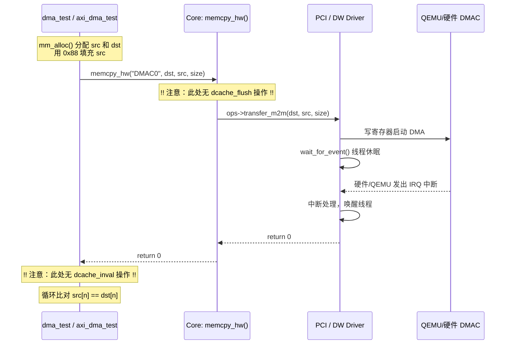

# GOS DMA 子系统现状分析与改进任务书

## 1. 现有 DMA 子系统实现分析

在目前的 GOS 代码库中，DMA 子系统采用了经典的“核心框架 + 底层驱动”的注册制架构，但在缓存处理上处于完全缺失的状态。

### 1.1 核心框架 (`core/dmac/dmac.c`)
核心层非常轻量，主要职责是管理系统中的多个 DMA 控制器，并对外提供统一的硬件拷贝接口。
*   **注册管理**：驱动通过 `register_dmac_device(struct dmac_device *dmac)` 注册。框架会自动为设备分配一个递增的字符串名字，例如 `"DMAC0"`, `"DMAC1"`。
*   **统一 API**：对上层暴露 `memcpy_hw(char *name, char *dst, char *src, unsigned int size)`。
*   **传输分发**：`memcpy_hw` 会通过 `get_dmac(name)` 在链表中查找到对应的设备结构体，并调用其底层的 `ops->transfer_m2m()` 函数指针。同时，核心层会尝试调用 `dma_mapping()` 进行 IOMMU 的地址翻译。

### 1.2 底层驱动实现
当前系统包含两个主要的底层驱动：
1.  **QEMU 自定义 PCI DMA (`drivers/dmac/my_pci_dmaengine.c`)**
    *   通过 PCI `vendor:0x1234, device:0x1` 匹配。
    *   使用 `ioremap` 映射简单的内存映射寄存器（SRC@0x0, DST@0x8, SIZE@0x100, START@0x200）。
    *   通过向 START 寄存器写 1 触发传输，随后通过 `wait_for_event_timeout` 阻塞当前线程。
    *   QEMU 触发 MSI-X 中断后，进入 `my_pci_dmaengine_irq_handler` 将 `done` 标志位置 1 唤醒线程。
2.  **DesignWare AXI DMA (`drivers/dmac/dmac_dw_axi.c`)**
    *   匹配设备树属性 `"dw,dmac"`。
    *   包含更复杂的通道配置（突发长度、数据位宽等），但同样遵循“写寄存器启动 -> 阻塞等待事件 -> 中断唤醒”的模型。

---

## 2. 现有 Test App 的调用链 (`dma_test.c` 为例)

目前的测试应用仅仅关注逻辑上的拷贝正确性，**完全没有进行任何 Cache 一致性维护**。



---

## 3. Cache 一致性改进的需求与理由

### 3.1 为什么必须要加 Cache 一致性处理？
现有的 GOS 能够在 QEMU 中顺利通过 `axi_dma_test` 且不报错，完全是因为 QEMU 作为一个软件模拟器，其默认内存模型是对 DMA 立刻可见的，且掩盖了 CPU L1/L2 Cache 的延迟。
一旦将这套代码烧录到真实的芯片或 FPGA 平台上，如果没有进行 Cache 处理，必然会发生以下致命错误：
1.  **数据写不出去 (CPU -> DMA)**：测试应用调用 `memset` 填充 `src` 内存时，数据仅停留在了 CPU Cache 中。DMA 控制器直接去读取 `src` 对应的真实物理内存时，读到的全是老数据。
2.  **数据读不回来 (DMA -> CPU)**：DMA 成功把数据写到了 `dst` 的物理内存中。但是测试应用去验证 `dst[n] == src[n]` 时，CPU 发现自己 Cache 里有 `dst` 的旧映射，直接返回了 Cache 里的错误（旧）数据。

### 3.2 现有的武器库
GOS 目前在 `include/gos/cache_flush.h` 中，基于 RISC-V Zicbom 扩展提供了最底层的单地址操作函数：
*   `cbo_cache_flush(unsigned long base)`：将单个 Cache Block 刷回主存。
*   `cbo_cache_inval(unsigned long base)`：使单个 Cache Block 失效。

---

## 4. 改进任务书 (Action Items)

为了彻底修复这个隐患，将 DMA 子系统升级为真实硬件可用的形态，你需要完成以下三个阶段的开发任务：

### 阶段一：实现 Range 级别的 Cache 操作 API (内存管理模块)
现有的 `cbo_cache_flush` 只能操作单个 base 地址对应的固定 Block（通常是 64 字节）。我们需要能够刷出一段缓冲区的函数。
*   **任务 1**：在 `mm/` 或相关的 cache 源码中，新增封装函数。
    ```c
    // 伪代码参考
    void dcache_flush_range(unsigned long start, unsigned long size) {
        unsigned long end = start + size;
        // 获取 Cache Block Size (可以宏定义为 64)
        for (unsigned long a = start & ~(64-1); a < end; a += 64) {
            cbo_cache_flush(a);
        }
        mb(); // 插入内存屏障
    }
    
    void dcache_inval_range(unsigned long start, unsigned long size) {
        // 同理，循环调用 cbo_cache_inval
    }
    ```

### 阶段二：重构核心 API `memcpy_hw` (DMA 核心层)
将 Cache 一致性处理收敛到核心框架中，不要让测试应用或底层驱动去操心。
*   **任务 2**：修改 `core/dmac/dmac.c` 中的 `memcpy_hw`（或内部实际干活的 `dma_transfer` 函数）。
    ```c
    int dma_transfer(struct dmac_device *dmac, char *dst, char *src, unsigned int size, int dir) {
        // 1. 发送前：刷出源数据的 Cache
        dcache_flush_range((unsigned long)src, size);
        
        // (可选) 如果 dst 不是刚分配的，最好也刷出并失效它，防止脏数据干扰
        dcache_flush_range((unsigned long)dst, size);
        dcache_inval_range((unsigned long)dst, size);
        
        // 2. 调用原有的底层硬件传输逻辑 (IOMMU 翻译等)
        ret = dmac->ops->transfer_m2m(...);
        
        // 3. 接收后：使目标数据的 Cache 失效，强迫接下来的 CPU 读取从主存取
        dcache_inval_range((unsigned long)dst, size);
        
        return ret;
    }
    ```

### 阶段三：测试与验证
*   **任务 3**：修改配置并编译 `build.sh default`。
*   **任务 4**：在 QEMU 启动后，运行 `dma_test DMAC0 4096` 和 `axi_dma_test_cp DMAC0 4096`。
*   *期望结果*：测试应当依然顺利通过，但此时系统已经具备了在真实芯片环境下的鲁棒性。
