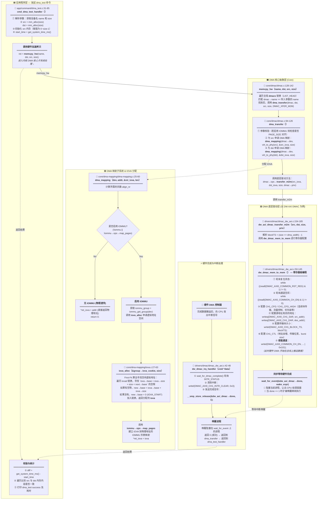

# GOS DMA 子系统与测试全景流程图解

> 本文档严格参考 GOS 项目源码，包含 `app/command/dma_test.c`、`core/dmac/dmac.c`、`core/dma-mapping/dma-mapping.c`、`core/dma-mapping/iova.c`、`drivers/dmac/dmac_dw_axi.c`，
> 使用全景图还原 DMA 数据拷贝测试的完整软硬件生命周期：从应用层发起、核心层设备匹配、IOVA虚拟地址分配、硬件驱动层配置、一直到中断返回的全部细节。

---

## 核心流程全景图：DMA Test 执行完整调用链

## DMA 关键机制解析

1. **抽象层解耦 (`dmac_ops`)**：
   - `core/dmac/dmac.c` 维护了全局 DMA 链表 (`LIST_HEAD(dmacs)`)。应用程序使用 `memcpy_hw` 时，只需指定驱动名称（如 `"DMAC0"`），核心层即可完成匹配。
   - 底层驱动（DW AXI DMAC 或 PCI DMA Engine）只需要实现并注册 `dmac_ops { .transfer_m2m = ... }`，将软硬件解耦。

2. **虚拟化映射与 IOMMU 透传 (`dma_mapping`)**：
   - DMA 子系统支持 IOMMU。在申请内存搬运时，通过统一入口 `dma_mapping` 进行虚拟地址映射。
   - `iova_alloc` 维护了虚拟地址分配状态（使用有序链表基于 First-Fit 算法找空闲块）。
   - 代码精妙之处：如果硬件没有开启 IOMMU，`dma_mapping` 会**优雅回退（Fallback）**直接返回传入的物理地址，从而无需改动驱动代码。

3. **同步与异步处理**：
   - 寄存器配置好并启动 DMA 后，CPU **不执行空转死等（busy wait）**，而是通过 `wait_for_event` 将当前进程休眠并让出 CPU。
   - 硬件 DMA 拷贝完成后触发 IRQ 中断，在 ISR 中断处理函数 `dw_dmac_irq_handler` 中将标志位 `done` 置 1。
   - 等待队列检测到条件达成，重新唤醒发起传输的进程，实现零拷贝过程中的 CPU 高效利用。
