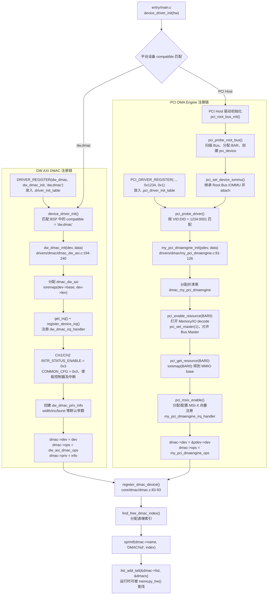
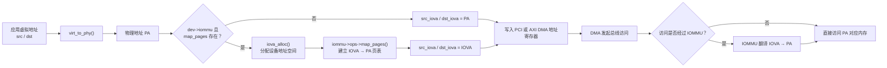
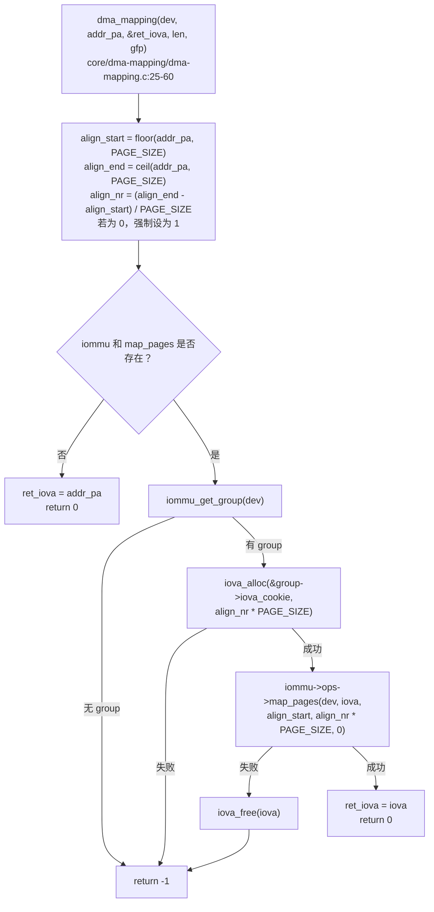
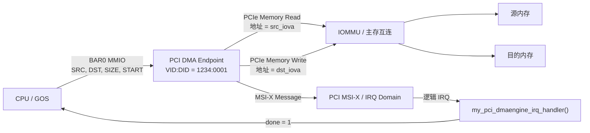
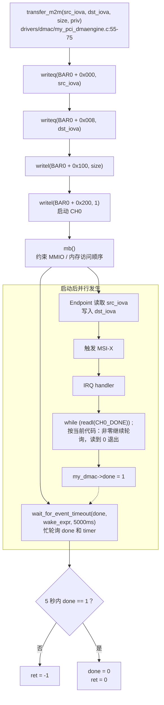
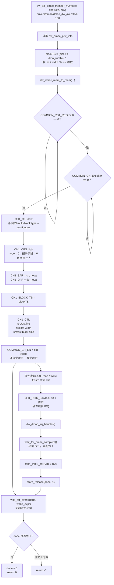
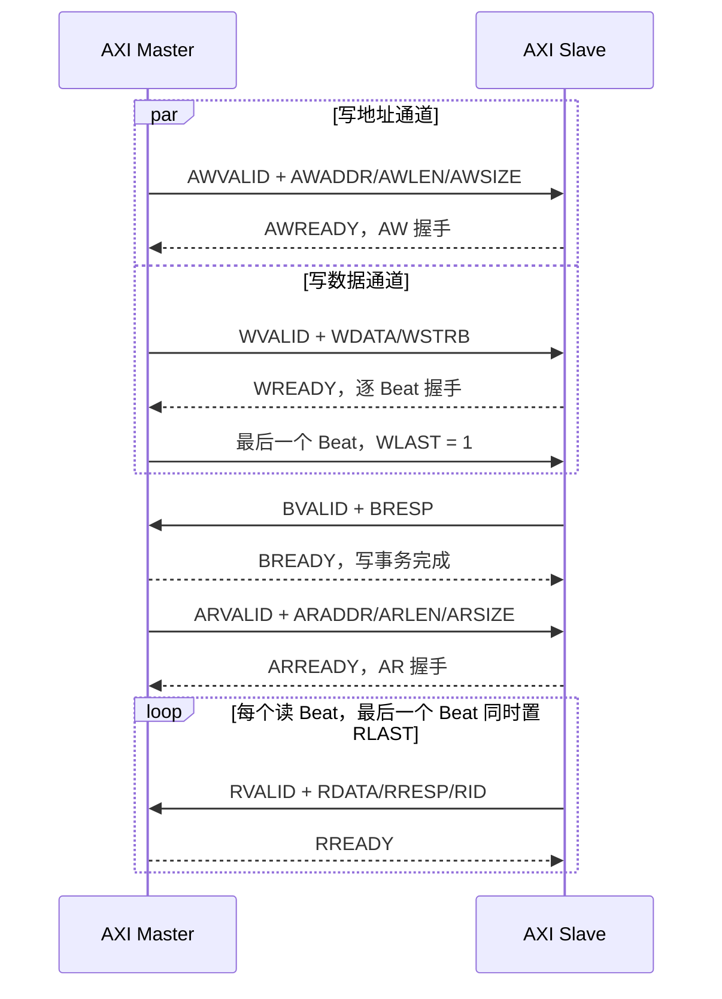

# GOS DMA 子系统完整调用链与 PCI / AXI Transfer 原理

> 本文以当前仓库源码为准，覆盖 DMA 控制器的注册与探测、`dma_test` 运行时调用链、Cache 一致性、PA/IOVA 映射、PCI DMA Engine 和 DesignWare AXI DMAC 两种 `transfer_m2m` 实现，以及中断完成和错误返回路径。
>
> 主要源码：`app/command/dma_test.c`、`core/dmac/dmac.c`、`core/dma-mapping/dma-mapping.c`、`core/dma-mapping/iova.c`、`core/event.c`、`drivers/dmac/my_pci_dmaengine.c`、`drivers/dmac/dmac_dw_axi.c`、`drivers/pci/pci.c`、`core/pci_device_driver.c`。

---

## 1. 总体架构

GOS DMA 子系统采用“应用统一入口 + DMA Core 分发 + 控制器驱动回调”的三层结构：

| 层次 | 主要对象 / 接口 | 职责 |
| --- | --- | --- |
| 应用层 | `dma_test`、`memcpy_hw()` | 分配与初始化缓冲区、选择 `DMACn`、发起传输、校验结果 |
| DMA Core | `struct dmac_device`、`struct dmac_ops`、`dma_transfer()` | 管理控制器链表、参数检查、Cache 维护、DMA 地址映射、调用驱动 |
| DMA Mapping | `dma_mapping()`、`iova_alloc()` | 无 IOMMU 时返回 PA；有 IOMMU 时分配 IOVA 并建立 IOVA→PA 映射 |
| 控制器驱动 | `my_pci_dmaengine_transfer_m2m()`、`dw_axi_dmac_transfer_m2m()` | 按硬件模型写寄存器、启动传输、等待完成中断 |
| 硬件 / 模型 | PCI Endpoint DMA Engine、DW AXI DMAC | 作为总线主设备读取源地址、写入目的地址并触发中断 |

目前 `struct dmac_ops` 只实现了 `transfer_m2m`。虽然 `dmac.h` 定义了 M2D、D2M、D2D 方向，但 `dma_transfer()` 对这些方向都会返回 `-1`。

---

## 2. DMA 控制器注册与探测链

`memcpy_hw("DMAC0", ...)` 能够工作有一个前提：控制器驱动必须在启动阶段完成探测，并通过 `register_dmac_device()` 加入全局 `dmacs` 链表。


```mermaid
flowchart TB
    BOOT["entry/main.c<br/>device_driver_init(hw)"] --> MATCH{"平台设备 compatible 匹配"}

    subgraph AXI_INIT["DW AXI DMAC 注册链"]
        AXI_TABLE["DRIVER_REGISTER(dw_dmac, dw_dmac_init, 'dw,dmac')<br/>放入 .driver_init_table"]
        AXI_MATCH["device_driver_init()<br/>匹配 BSP 中的 compatible = 'dw,dmac'"]
        AXI_PROBE["dw_dmac_init(dev, data)<br/>drivers/dmac/dmac_dw_axi.c:194-240"]
        AXI_ALLOC["分配 dmac_dw_axi<br/>ioremap(dev->base, dev->len)"]
        AXI_IRQ["get_irq() + register_device_irq()<br/>注册 dw_dmac_irq_handler"]
        AXI_ENABLE["CH1/CH2 INTR_STATUS_ENABLE = 0x3<br/>COMMON_CFG = 0x3，使能控制器及中断"]
        AXI_PRIV["创建 dw_dmac_priv_info<br/>width/inc/burst 等默认参数"]
        AXI_BIND["dmac->dev = dev<br/>dmac->ops = dw_axi_dmac_ops<br/>dmac->priv = info"]

        AXI_TABLE --> AXI_MATCH --> AXI_PROBE --> AXI_ALLOC
        AXI_ALLOC --> AXI_IRQ --> AXI_ENABLE --> AXI_PRIV --> AXI_BIND
    end

    subgraph PCI_INIT["PCI DMA Engine 注册链"]
        PCI_TABLE["PCI_DRIVER_REGISTER(..., 0x1234, 0x1)<br/>放入 .pci_driver_init_table"]
        PCI_HOST["PCI Host 驱动初始化<br/>pci_root_bus_init()"]
        PCI_ENUM["pci_probe_root_bus()<br/>扫描 Bus、分配 BAR、创建 pci_device"]
        PCI_IOMMU["pci_set_device_iommu()<br/>继承 Root Bus IOMMU 并 attach"]
        PCI_MATCH["pci_probe_driver()<br/>按 VID:DID = 1234:0001 匹配"]
        PCI_PROBE["my_pci_dmaengine_init(pdev, data)<br/>drivers/dmac/my_pci_dmaengine.c:81-126"]
        PCI_ALLOC["分配并清零 dmac_my_pci_dmaengine"]
        PCI_CMD["pci_enable_resource(BAR0)<br/>打开 Memory/IO decode<br/>pci_set_master(1)，允许 Bus Master"]
        PCI_BAR["pci_get_resource(BAR0)<br/>ioremap(BAR0) 得到 MMIO base"]
        PCI_IRQ["pci_msix_enable()<br/>分配/配置 MSI-X 向量<br/>注册 my_pci_dmaengine_irq_handler"]
        PCI_BIND["dmac->dev = &pdev->dev<br/>dmac->ops = my_pci_dmaengine_ops"]

        PCI_TABLE --> PCI_MATCH
        PCI_HOST --> PCI_ENUM --> PCI_IOMMU --> PCI_MATCH
        PCI_MATCH --> PCI_PROBE --> PCI_ALLOC --> PCI_CMD --> PCI_BAR --> PCI_IRQ --> PCI_BIND
    end

    MATCH -->|"dw,dmac"| AXI_MATCH
    MATCH -->|"PCI Host"| PCI_HOST

    AXI_BIND --> REGISTER
    PCI_BIND --> REGISTER

    REGISTER["register_dmac_device()<br/>core/dmac/dmac.c:83-93"] --> INDEX["find_free_dmac_index()<br/>分配递增索引"]
    INDEX --> NAME["sprintf(dmac->name, 'DMAC%d', index)"]
    NAME --> LIST["list_add_tail(&dmac->list, &dmacs)<br/>运行时可被 memcpy_hw() 查找"]
```

注意：

- `DMAC0`、`DMAC1` 表示注册顺序，不固定代表 PCI 或 AXI。实际对应关系应通过 `lsdmac` 查看。
- AXI 路径由普通平台设备 `compatible` 匹配；PCI 路径先由 PCI Host 枚举 Endpoint，再按 Vendor ID / Device ID 匹配。
- 两个驱动都使用文件级全局指针保存控制器实例，因此当前实现本质上按单实例设计。

---

## 3. `dma_test` 到硬件完成的完整运行时调用链

下面的图把应用入口、DMA Core、映射、两种驱动分支、中断和返回路径放在同一条调用链中。


```mermaid
flowchart TB
    CMD["Shell: dma_test DMACn size"] --> APP_PARSE

    subgraph APP["应用层：app/command/dma_test.c:31-84"]
        APP_PARSE{"参数至少 2 个<br/>size 是否为数字？"}
        APP_PARSE -->|"否"| APP_BAD["打印 Usage / invalid input<br/>return -1"]
        APP_PARSE -->|"是"| APP_ALLOC["name = argv[0]<br/>size = atoi(argv[1])<br/>mm_alloc(src) + mm_alloc(dst)"]
        APP_ALLOC -->|"分配失败"| APP_NOMEM["打印 alloc failed<br/>return -1"]
        APP_ALLOC -->|"成功"| APP_FILL["逐字节初始化 src[i] = i<br/>记录 start_time"]
        APP_FILL --> CALL["memcpy_hw(name, dst, src, size)"]
    end

    subgraph CORE["DMA Core：core/dmac/dmac.c:95-156"]
        CALL --> LOOKUP["遍历全局 dmacs 链表<br/>strncmp(dmac->name, name, 128)"]
        LOOKUP --> FOUND{"找到 DMACn？"}
        FOUND -->|"否"| CORE_ERR["return -1"]
        FOUND -->|"是"| XFER["dma_transfer(dmac, dst, src, size, DMAC_XFER_M2M)"]

        XFER --> VALID{"dmac / ops / dev 有效？"}
        VALID -->|"否"| CORE_ERR
        VALID -->|"是"| ZERO{"size == 0？"}
        ZERO -->|"是"| CORE_OK["return 0"]
        ZERO -->|"否"| ALIGN{"设备挂有 IOMMU？"}
        ALIGN -->|"是且 src/dst<br/>非 PAGE_SIZE 对齐"| CORE_ERR
        ALIGN -->|"否，或地址已对齐"| DIR{"dir == M2M 且<br/>transfer_m2m 非空？"}
        DIR -->|"否"| CORE_ERR

        DIR -->|"是"| CACHE["Cache 一致性预处理<br/>clean(src)<br/>flush(dst)<br/>invalidate(dst)"]
        CACHE --> MAP_SRC["dma_mapping(dev, virt_to_phy(src),<br/>&src_iova, size, NULL)"]
        MAP_SRC -->|"失败"| CORE_ERR
        MAP_SRC -->|"成功"| MAP_DST["dma_mapping(dev, virt_to_phy(dst),<br/>&dst_iova, size, NULL)"]
        MAP_DST -->|"失败"| CORE_ERR
        MAP_DST -->|"成功"| OPS["dmac->ops->transfer_m2m(<br/>src_iova, dst_iova, size, dmac->priv)"]
    end

    OPS --> WHICH{"所选 DMACn 的 ops"}

    subgraph PCI["PCI DMA Engine 分支"]
        WHICH -->|"my_pci_dmaengine_ops"| PCI_PROG["写 BAR0 MMIO<br/>CH0_SRC = src_iova<br/>CH0_DST = dst_iova<br/>TRAN_SIZE = size"]
        PCI_PROG --> PCI_START["CH0_START = 1<br/>mb()"]
        PCI_START --> PCI_HW["PCI Endpoint 以 Bus Master 身份<br/>发起 Memory Read / Memory Write"]
        PCI_HW --> PCI_MSIX["传输完成，Endpoint 触发 MSI-X"]
        PCI_MSIX --> PCI_ISR["my_pci_dmaengine_irq_handler()<br/>轮询 CH0_DONE，done = 1"]
        PCI_START --> PCI_WAIT["wait_for_event_timeout(..., 5000ms)<br/>CPU 忙轮询 done 或定时器"]
        PCI_ISR -.->|"更新 done"| PCI_WAIT
        PCI_WAIT --> PCI_DONE{"done == 1？"}
        PCI_DONE -->|"否，超时"| PCI_RET_ERR["return -1"]
        PCI_DONE -->|"是"| PCI_RET_OK["done = 0<br/>return 0"]
    end

    subgraph AXI["DW AXI DMAC 分支"]
        WHICH -->|"dw_axi_dmac_ops"| AXI_CALC["按 priv 计算 blockTS、width、inc、burst"]
        AXI_CALC --> AXI_PROG["dw_dmac_mem_to_mem()<br/>等待复位结束及 CH1 空闲<br/>配置 CFG / SAR / DAR / BLOCK_TS / CTL"]
        AXI_PROG --> AXI_START["COMMON_CH_EN |= 0x101<br/>使能通道"]
        AXI_START --> AXI_HW["DMAC 在 AXI 上发起读事务和写事务<br/>完成内存到内存搬运"]
        AXI_HW --> AXI_IRQ["CH1 完成中断"]
        AXI_IRQ --> AXI_ISR["dw_dmac_irq_handler()<br/>等待 INTR_STATUS bit 1<br/>INTR_CLEAR = 0x3<br/>store_release(done, 1)"]
        AXI_START --> AXI_WAIT["wait_for_event(done, wake_expr)<br/>CPU 忙轮询，无超时"]
        AXI_ISR -.->|"更新 done"| AXI_WAIT
        AXI_WAIT --> AXI_RET["done = 0<br/>return 0"]
    end

    PCI_RET_ERR --> RETURN
    PCI_RET_OK --> RETURN
    AXI_RET --> RETURN
    CORE_ERR --> RETURN
    CORE_OK --> RETURN

    RETURN["返回 memcpy_hw() / dma_test"] --> APP_RET{"ret == -1？"}
    APP_RET -->|"是"| APP_FAIL["打印 memcpy_hw failed<br/>return -1"]
    APP_RET -->|"否"| VERIFY["计算耗时<br/>逐字节比较 src 与 dst"]
    VERIFY -->|"不一致"| VERIFY_FAIL["打印 dma_test failed<br/>return -1"]
    VERIFY -->|"一致"| SUCCESS["打印 dma_test success 和耗时<br/>return 0"]
```

这个调用是同步 API：`memcpy_hw()` 只有在驱动观察到完成标志或 PCI 路径超时后才返回。硬件搬运与 CPU 指令执行是异步的，但当前等待函数采用忙轮询，不是睡眠等待队列。

---

## 4. Cache、PA 与 IOVA 数据通路

### 4.1 为什么驱动收到的不是应用虚拟地址


```mermaid
flowchart LR
    VA["应用虚拟地址<br/>src / dst"] --> V2P["virt_to_phy()"]
    V2P --> PA["物理地址 PA"]
    PA --> IOMMU{"dev->iommu 且<br/>map_pages 存在？"}
    IOMMU -->|"否"| DIRECT["src_iova / dst_iova = PA"]
    IOMMU -->|"是"| ALLOC["iova_alloc()<br/>分配设备地址空间"]
    ALLOC --> MAP["iommu->ops->map_pages()<br/>建立 IOVA → PA 页表"]
    MAP --> IOVA["src_iova / dst_iova = IOVA"]
    DIRECT --> REG["写入 PCI 或 AXI DMA 地址寄存器"]
    IOVA --> REG
    REG --> DMA["DMA 发起总线访问"]
    DMA --> IOMMU2{"访问是否经过 IOMMU？"}
    IOMMU2 -->|"否"| RAM["直接访问 PA 对应内存"]
    IOMMU2 -->|"是"| TRANS["IOMMU 翻译 IOVA → PA"]
    TRANS --> RAM
```

`dma_transfer()` 传给驱动的 `src` / `dst` 参数从语义上说是 DMA 地址：无 IOMMU 时等于物理地址，有 IOMMU 时为 IOVA。PCI Endpoint 和 AXI DMAC 都不应直接使用应用 VA。

### 4.2 当前 `dma_mapping()` 的具体流程


```mermaid
flowchart TB
    M0["dma_mapping(dev, addr_pa, &ret_iova, len, gfp)<br/>core/dma-mapping/dma-mapping.c:25-60"] --> RANGE["align_start = floor(addr_pa, PAGE_SIZE)<br/>align_end = ceil(addr_pa, PAGE_SIZE)<br/>align_nr = (align_end - align_start) / PAGE_SIZE<br/>若为 0，强制设为 1"]
    RANGE --> HAS{"iommu 和 map_pages 是否存在？"}
    HAS -->|"否"| PASS["ret_iova = addr_pa<br/>return 0"]
    HAS -->|"是"| GROUP["iommu_get_group(dev)"]
    GROUP -->|"无 group"| ERR["return -1"]
    GROUP -->|"有 group"| IOVA_ALLOC["iova_alloc(&group->iova_cookie,<br/>align_nr * PAGE_SIZE)"]
    IOVA_ALLOC -->|"失败"| ERR
    IOVA_ALLOC -->|"成功"| MAP_PAGE["iommu->ops->map_pages(dev, iova,<br/>align_start, align_nr * PAGE_SIZE, 0)"]
    MAP_PAGE -->|"失败"| ROLLBACK["iova_free(iova)"] --> ERR
    MAP_PAGE -->|"成功"| OUT["ret_iova = iova<br/>return 0"]
```

需要区分设计意图和当前代码现状：

- 无 IOMMU 时是物理地址透传，不会分配 IOVA。
- 有 IOMMU 时，`dma_transfer()` 要求 `src` 和 `dst` 的 VA 均按 4 KiB 页对齐。
- `iova_alloc()` 先用 `N_PAGE(len)` 把请求扩大到整页，再扫描 `iova_cookie` 链表中的地址间隙；找到间隙时从前一段 IOVA 的末尾继续分配，否则从 `IOVA_START = 0` 开始，最后把新节点加入链表尾部。
- 当前 `dma_mapping()` 计算 `align_end` 时只使用了 `addr`，没有使用 `addr + len`，所以实际映射页数不会随 `len` 增长；对大于一页的传输，这很可能只建立首个页面的映射。
- `dma_transfer()` 成功后没有 unmap / `iova_free()`；目的映射失败时也不会回滚已经成功的源映射。反复传输可能持续占用 IOVA 和页表资源。

### 4.3 Cache 一致性

`core/dmac/dmac.c:122-124` 在启动 DMA 前执行：

1. `dcache_clean_range(src, size)`：把 CPU 对源缓冲区的脏 Cache Line 写回内存，确保 DMA 读到新数据。
2. `dcache_flush_range(dst, size)`：写回并失效目的缓冲区，避免已有脏行稍后覆盖 DMA 写入。
3. `dcache_inval_range(dst, size)`：再次使目的范围失效。

范围函数按 64 字节 RISC-V CBOM Cache Block 向外对齐，并在操作后执行 `mb()`。当前代码在 DMA 完成后的 `dcache_inval_range(dst, size)` 被注释掉了，因此只做“启动前失效”，没有显式做“完成后失效”。如果 CPU 在 DMA 进行期间重新取回了目的 Cache Line，完成后读取仍可能看到旧值。

---

## 5. PCI DMA Engine：Transfer 实现与原理

### 5.1 控制面与数据面

PCI 路径存在两条不同的数据流：

- **控制面**：CPU 通过 `ioremap()` 后的 BAR0 MMIO 写入源地址、目的地址、长度和 START。
- **数据面**：PCI Endpoint 在 `PCI_COMMAND_MASTER` 已使能的前提下成为 Bus Master，主动向主存发起 PCIe Memory Read，并把数据通过 Memory Write 写到目的地址。
- **完成面**：Endpoint 发出 MSI-X，Root Complex / MSI 中断域把它路由到 CPU，ISR 设置软件 `done` 标志。


```mermaid
flowchart LR
    CPU["CPU / GOS"] -->|"BAR0 MMIO<br/>SRC, DST, SIZE, START"| EP["PCI DMA Endpoint<br/>VID:DID = 1234:0001"]
    EP -->|"PCIe Memory Read<br/>地址 = src_iova"| IOMMU["IOMMU / 主存互连"]
    IOMMU --> SRC["源内存"]
    EP -->|"PCIe Memory Write<br/>地址 = dst_iova"| IOMMU
    IOMMU --> DST["目的内存"]
    EP -->|"MSI-X Message"| MSI["PCI MSI-X / IRQ Domain"]
    MSI -->|"逻辑 IRQ"| ISR["my_pci_dmaengine_irq_handler()"]
    ISR -->|"done = 1"| CPU
```

### 5.2 `my_pci_dmaengine_transfer_m2m()` 寄存器调用链


```mermaid
flowchart TB
    P0["transfer_m2m(src_iova, dst_iova, size, priv)<br/>drivers/dmac/my_pci_dmaengine.c:55-75"] --> P1["writeq(BAR0 + 0x000, src_iova)"]
    P1 --> P2["writeq(BAR0 + 0x008, dst_iova)"]
    P2 --> P3["writel(BAR0 + 0x100, size)"]
    P3 --> P4["writel(BAR0 + 0x200, 1)<br/>启动 CH0"]
    P4 --> P5["mb()<br/>约束 MMIO / 内存访问顺序"]
    P5 --> HW
    P5 --> WAIT

    subgraph PAR["启动后并行发生"]
        direction LR
        HW["Endpoint 读取 src_iova<br/>写入 dst_iova"] --> MSIX["触发 MSI-X"]
        MSIX --> ISR0["IRQ handler"]
        ISR0 --> POLL["while (readl(CH0_DONE)) ;<br/>按当前代码：非零继续轮询，读到 0 退出"]
        POLL --> FLAG["my_dmac->done = 1"]

        WAIT["wait_for_event_timeout(done,<br/>wake_expr, 5000ms)<br/>忙轮询 done 和 timer"]
        FLAG -.-> WAIT
    end

    WAIT --> CHECK{"5 秒内 done == 1？"}
    CHECK -->|"否"| TIMEOUT["ret = -1"]
    CHECK -->|"是"| RESET["done = 0<br/>ret = 0"]
```

PCI 自定义寄存器定义如下：

| 通道 | SRC | DST | DONE | TRANS_SIZE | START | 当前是否使用 |
| --- | ---: | ---: | ---: | ---: | ---: | --- |
| CH0 | `0x000` | `0x008` | `0x010` | `0x100` | `0x200` | 是 |
| CH1 | `0x1000` | `0x1008` | `0x1010` | `0x1100` | `0x1200` | 否，仅定义 |

几个实现细节：

- `writeq` 用于 64 位 DMA 地址，`writel` 用于 32 位长度和控制值。
- GOS 的 `writel()` 自身在 MMIO Store 前带有 `fence w,o`，启动后又显式执行一次全屏障 `mb()`。
- `my_dmaengine_wait_for_complete()` 的 DONE 极性以设备模型约定为准；源码逻辑是“读到非零继续等，读到零才认为 ISR 可结束”。
- 超时只检查软件 `done`，没有读取并上报 Endpoint 的错误状态，也没有超时后的通道复位/终止流程。
- `priv` 参数未使用，函数直接访问全局 `my_dmac`，所以不支持多个相同 PCI DMA Endpoint 独立并发工作。

---

## 6. DesignWare AXI DMAC：Transfer 实现与原理

### 6.1 AXI M2M 工作原理

DW AXI DMAC 是 SoC 内部的 AXI Master。CPU 只负责配置控制寄存器；通道使能后，DMAC 的读主接口从 `SAR` 指向的地址发出 AXI Read Burst，内部缓冲数据，再由写主接口向 `DAR` 指向的地址发出 AXI Write Burst。源/目的地址是否递增、每个数据项宽度、一个 Burst 包含多少项，都由通道 `CTL` / `CFG` 控制。

当前驱动采用：

- 固定使用源码命名中的 CH1（寄存器窗口基址 `0x100`）。
- 单个 contiguous block，不使用 LLP 链表。
- M2M、DMAC 流控，源和目的地址递增。
- 初始化参数 `dma_width = 0`，所以 `blockTS = size - 1`；按 DW AXI DMAC 常见编码，width 0 对应 1 字节数据项。
- `src_burstsize = des_burstsize = 0`。`burst_len = 7` 虽被赋值，但设置 `CTL_HI` 的代码位于 `#if 0`，当前不生效。

### 6.2 AXI 寄存器编程与完成链


```mermaid
flowchart TB
    A0["dw_axi_dmac_transfer_m2m(src, dst, size, priv)<br/>drivers/dmac/dmac_dw_axi.c:154-188"] --> A1["读取 dw_dmac_priv_info"]
    A1 --> A2["blockTS = (size >> dma_width) - 1<br/>取 inc / width / burst 参数"]
    A2 --> A3["dw_dmac_mem_to_mem(...)"]

    A3 --> RESET_WAIT{"COMMON_RST_REG bit 0 == 0？"}
    RESET_WAIT -->|"否"| RESET_WAIT
    RESET_WAIT -->|"是"| IDLE_WAIT{"COMMON_CH_EN bit 0 == 0？"}
    IDLE_WAIT -->|"否"| IDLE_WAIT
    IDLE_WAIT -->|"是"| CFG_LOW["CH1_CFG low<br/>源/目的 multi-block type = contiguous"]

    CFG_LOW --> CFG_HIGH["CH1_CFG high<br/>type = 0、握手字段 = 0<br/>priority = 7"]
    CFG_HIGH --> ADDR["CH1_SAR = src_iova<br/>CH1_DAR = dst_iova"]
    ADDR --> BLOCK["CH1_BLOCK_TS = blockTS"]
    BLOCK --> CTL["CH1_CTL<br/>src/dst inc<br/>src/dst width<br/>src/dst burst size"]
    CTL --> ENABLE["COMMON_CH_EN = old | 0x101<br/>通道使能位 + 写使能位"]

    ENABLE --> AXI_BUS["硬件发起 AXI Read / Write<br/>把 src 搬到 dst"]
    ENABLE --> SW_WAIT["wait_for_event(done, wake_expr)<br/>无超时忙轮询"]

    AXI_BUS --> INTR["CH1_INTR_STATUS bit 1 置位<br/>硬件触发 IRQ"]
    INTR --> ISR["dw_dmac_irq_handler()"]
    ISR --> ISR_POLL["wait_for_dmac_complete()<br/>轮询 bit 1，直到为 1"]
    ISR_POLL --> CLEAR["CH1_INTR_CLEAR = 0x3"]
    CLEAR --> RELEASE["store_release(done, 1)"]
    RELEASE -.-> SW_WAIT
    SW_WAIT --> RET_CHECK{"done 是否为 1？"}
    RET_CHECK -->|"是"| RET_OK["done = 0<br/>return 0"]
    RET_CHECK -->|"理论上的否"| RET_ERR["return -1"]
```

关键寄存器：

| 寄存器 | 偏移 | 当前用途 |
| --- | ---: | --- |
| `COMMON_CFG` | `0x010` | 初始化时写 `0x3`，使能 DMAC 及中断 |
| `COMMON_CH_EN` | `0x018` | 检查通道空闲，并用 `0x101` 使能传输 |
| `COMMON_RST_REG` | `0x058` | 等待软件复位结束 |
| `CH1_SAR` | `0x100` | 64 位源 DMA 地址 |
| `CH1_DAR` | `0x108` | 64 位目的 DMA 地址 |
| `CH1_BLOCK_TS` | `0x110` | block 中的数据项数减一 |
| `CH1_CTL` | `0x118` | 地址递增、传输宽度、Burst 数据项数 |
| `CH1_CFG` | `0x120` | multi-block、传输类型、流控、握手、优先级 |
| `CH1_INTR_STATUS_ENABLE` | `0x180` | 初始化时写 `0x3` |
| `CH1_INTR_STATUS` | `0x188` | ISR 轮询 `0x2` 完成位 |
| `CH1_INTR_CLEAR` | `0x198` | ISR 写 `0x3` 清状态 |

AXI 路径没有超时：复位等待、通道空闲等待、ISR 内状态等待和 `wait_for_event()` 都可能无限轮询。当前 ISR 只把 `0x2` 当作完成条件并固定写 `0x3` 清状态；驱动没有检查其他硬件错误状态，也没有返回细分的错误码。

---

## 7. PCI 与 AXI Transfer 对比

| 对比项 | PCI DMA Engine | DW AXI DMAC |
| --- | --- | --- |
| 发现方式 | PCI 总线枚举，匹配 `1234:0001` | 平台设备匹配 `"dw,dmac"` |
| 控制寄存器来源 | Endpoint BAR0 | SoC MMIO Resource |
| 成为 DMA Master 的前提 | `pci_set_master(pdev, 1)` | `COMMON_CFG` 使能 DMAC |
| 编程模型 | SRC、DST、SIZE、START，设备模型封装细节 | 显式配置 CFG、SAR、DAR、BLOCK_TS、CTL、CH_EN |
| 当前使用通道 | CH0 | 源码命名 CH1 / 窗口 `0x100` |
| 地址来源 | PA 或 IOVA | PA 或 IOVA |
| 数据总线 | PCIe Memory Read / Write | AXI Read / Write |
| 完成中断 | MSI-X | 平台 IRQ（如 PLIC） |
| 软件等待 | 忙轮询，5 秒超时 | 忙轮询，无超时 |
| 完成清理 | IRQ 中轮询 DONE；无显式错误清除定义 | 轮询 `INTR_STATUS & 0x2`，写 `INTR_CLEAR = 0x3` |
| Scatter-Gather / LLP | 未实现 | 寄存器已定义 LLP，但当前未使用 |
| 多实例 / 并发 | 全局 `my_dmac`，不支持 | 全局 `dw_axi_dmac`，不支持 |

两种驱动对 DMA Core 暴露完全相同的函数签名：

```c
int (*transfer_m2m)(unsigned long src,
                    unsigned long dst,
                    int size,
                    void *priv);
```

因此公共层不关心传输经 PCIe 还是 AXI，只根据选中的 `DMACn` 间接调用相应 `ops`。真正不同的是驱动如何把 DMA 地址、长度和完成条件翻译成硬件寄存器操作。

---

## 8. 返回值与异常路径

| 位置 | 条件 | 结果 |
| --- | --- | --- |
| `dma_test` | 参数不足、size 非数字、分配失败 | `-1` |
| `memcpy_hw` | `dmacs` 中找不到指定名称 | `-1` |
| `dma_transfer` | dmac / ops / dev 无效 | `-1` |
| `dma_transfer` | `size == 0` | `0`，不访问硬件 |
| `dma_transfer` | IOMMU 存在但 src / dst 未按页对齐 | `-1` |
| `dma_transfer` | 非 M2M 或驱动未实现 `transfer_m2m` | `-1` |
| `dma_mapping` | group、IOVA 分配或 IOMMU map 失败 | `-1` |
| PCI 驱动 | 5 秒内未观察到 `done` | `-1` |
| AXI 驱动 | 硬件或 IRQ 无响应 | 当前不会超时，调用可能一直卡住 |
| `dma_test` | DMA 返回成功但数据比较不一致 | `-1` |
| 完整成功 | 驱动完成且 src / dst 每字节相同 | `0` |

---

## 9. 阅读当前实现时必须注意的限制

1. **等待函数是 Busy Polling**

   `core/event.c` 的 `wait_for_event()` 和 `wait_for_event_timeout()` 都是 `while` 循环，不会阻塞任务、进入等待队列或主动让出 CPU。中断只负责修改 `done`，等待侧持续读取该变量。

2. **AXI 的 `done` 没有显式初始化**

   PCI 驱动在分配后 `memset()` 清零整个私有结构；AXI 驱动分配 `dw_axi_dmac` 后没有清零，也没有显式写 `done = 0`，其初值依赖分配器返回内存的原内容。

3. **一次只适合一个同步请求**

   两个驱动都只有一个全局实例、一个 `done` 和一个固定通道，也没有锁。并发调用可能互相覆盖地址/长度寄存器并混用完成事件。

4. **IOMMU 映射生命周期不完整**

   映射长度计算没有覆盖完整 `len`，传输后也没有 unmap，错误路径回滚不完整。无 IOMMU 的物理透传路径不受 IOVA 泄漏影响。

5. **完成后的目的 Cache 失效被注释**

   当前仅在启动前处理目的 Cache。更稳妥的非一致性 DMA 流程通常还需要在确认硬件完成后 invalidate `dst`，然后 CPU 才读取结果。

6. **缺少硬件错误恢复**

   PCI 超时后没有停止或复位通道；AXI 没有超时，且没有把错误中断转换为独立返回码。两条路径都缺少 cancel、reset、残余字节数和错误详情。

7. **测试缓冲区没有释放**

   `app/command/dma_test.c` 的成功和失败返回路径都没有对 `src` / `dst` 调用 `mm_free()`，重复执行测试会持续消耗普通内存。

---

## 10. 一句话总结

`dma_test` 的核心路径是：

```text
dma_test
  → memcpy_hw 按 DMACn 查找控制器
  → dma_transfer 做 Cache 维护和 PA/IOVA 映射
  → dmac->ops->transfer_m2m 分派到 PCI 或 AXI 驱动
  → 驱动写寄存器启动硬件
  → DMA 作为 PCIe/AXI Master 搬运数据
  → 完成中断设置 done
  → 忙轮询退出并逐层返回
  → dma_test 比较 src / dst
```

PCI 实现把硬件细节封装成一组简单 BAR 寄存器，并通过 MSI-X 完成；AXI 实现直接配置通道的地址、block、位宽、递增和 burst 字段，并通过平台中断完成。两者在 DMA Core 看来都是同一个 `transfer_m2m` 回调。

---

## 11. PCI / PCIe 协议面试常考考点

本项目驱动接口命名为 PCI，但 `my_pci_dmaengine` 所处的实际系统形态是 PCIe：设备通过 PCI 配置空间和 BAR 被枚举，数据传输使用 PCIe Endpoint Bus Master DMA，完成通知使用 MSI-X。面试时应先说明“PCI 软件模型被 PCIe 继承”，再区分两者的物理与链路实现。

### 11.1 传统 PCI 与 PCIe 的区别

| 对比项 | 传统 PCI | PCIe |
| --- | --- | --- |
| 物理连接 | 并行、共享总线 | 高速串行、点到点连接 |
| 双工方式 | 多设备共享带宽 | 每条 Lane 独立收发，全双工 |
| 拓扑 | Host + 共享 Bus + Device | Root Complex + Switch + Endpoint |
| 传输形式 | 总线周期 | 分层 Packet：TLP / DLLP / Ordered Set |
| 仲裁 | 共享总线需要集中仲裁 | 每条点到点链路独立仲裁和流控 |
| 软件模型 | 配置空间、BAR、BDF | 基本继承 PCI 软件模型，并扩展能力 |
| 中断 | INTx 为主，也可支持 MSI | INTx、MSI、MSI-X，通常优先 MSI-X |

高频回答：PCIe 并不是简单的“更快 PCI 总线”，而是保留 PCI 配置/枚举软件模型、重新设计为串行点到点分层网络的协议。

### 11.2 PCIe 拓扑与 BDF

- **Root Complex（RC）**：连接 CPU/内存系统与 PCIe Fabric，是枚举和资源分配的发起者。
- **Endpoint（EP）**：最终功能设备，例如 NVMe、网卡、GPU，以及本项目的 DMA Engine。
- **Switch**：一个 Upstream Port 连接 RC，多个 Downstream Port 连接 Endpoint；负责 TLP 路由。
- **Bridge**：连接不同 Bus 层级，决定 Secondary / Subordinate Bus Number。
- **BDF**：`Bus:Device.Function`。传统格式通常为 8-bit Bus、5-bit Device、3-bit Function，一个 Device 最多 8 个 Function。

面试常问“为什么需要 Bus Number”：PCIe 虽然物理上是点到点树形拓扑，但软件仍使用 PCI Bus 编号和 BDF 标识、路由及访问设备配置空间。

### 11.3 枚举、配置空间与 BAR

典型枚举过程：

1. RC 扫描 Bus 上可能存在的 BDF，读取 Vendor ID；返回全 1 通常表示 Function 不存在。
2. 读取 Device ID、Class Code、Header Type 和 Capability List。
3. 探测 BAR 大小，分配不冲突且满足对齐要求的 MMIO / IO 地址窗口。
4. 把分配结果写回 BAR，配置 Bridge Window 和 Bus Number。
5. 设置 `PCI_COMMAND` 中的 Memory Space / IO Space Enable。
6. 驱动准备好 DMA 后设置 Bus Master Enable。
7. 配置 MSI/MSI-X、IOMMU，再绑定具体设备驱动。

传统 PCI 配置空间头部位于 256 Byte 空间内；PCIe Function 通常支持扩展到 4 KiB 的 Configuration Space。标准 Capability 位于传统区域，PCIe Extended Capability 从 `0x100` 开始，可承载 AER、SR-IOV 等扩展能力。

BAR 高频问题：

- BAR 描述的是设备暴露给 CPU 的地址窗口，不是 DMA 缓冲区。
- Memory BAR 可能为 32 位或 64 位；64 位 BAR 会连续占用两个 BAR 寄存器。
- BAR 大小通常通过“保存原值 → 写全 1 → 读回硬件可写掩码 → 计算大小 → 恢复”获得。
- BAR 地址必须按窗口大小对齐；系统固件或 OS 负责把它分配到 Host 地址空间。
- `ioremap(BAR)` 得到的是 CPU 访问设备寄存器的 VA；写入 DMA SRC/DST 寄存器的则是设备可访问的 DMA Address，两者不是同一概念。

在 GOS 中对应：

- `pci_probe_root_bus()`：扫描总线、分配资源、创建 `pci_device`、匹配驱动。
- `pci_enable_resource(pdev, 1 << 0)`：使能 BAR0 对应的 Memory/IO Decode。
- `pci_set_master(pdev, 1)`：设置 `PCI_COMMAND_MASTER`，允许 Endpoint 主动发起 DMA。
- `pci_get_resource()` + `ioremap()`：把 BAR0 映射成 CPU 可访问的 MMIO 地址。

### 11.4 PCIe 三层协议

| 层 | 主要职责 | 高频关键词 |
| --- | --- | --- |
| Transaction Layer | 生成和解析 TLP，处理地址、请求、Completion 和 Ordering | MRd、MWr、Cpl、CplD、Tag、Requester ID |
| Data Link Layer | 相邻链路可靠传输、序号、LCRC、ACK/NAK、Replay | DLLP、Sequence Number、Replay Buffer |
| Physical Layer | Lane、编码、均衡、链路训练和电气传输 | LTSSM、Lane、Gen、Link Width、L0/L1 |

常见追问：

- Transaction Layer 的 Completion 是端到端事务语义；Data Link Layer 的 ACK/NAK 只确认相邻两端成功接收了一个 TLP，二者不能混为一谈。
- Data Link 层可通过 Replay 修复链路传输错误，但设备访问了非法地址、Unsupported Request 等事务错误仍要由 Completion Status 或 AER 处理。

### 11.5 Posted、Non-Posted 与 Completion

| 类型 | 典型事务 | 是否要求 Completion | 特点 |
| --- | --- | --- | --- |
| Posted Request | Memory Write、Message | 通常不要求 | 发送方可以较早释放事务资源，吞吐高 |
| Non-Posted Request | Memory Read、Config Read/Write、IO Read/Write | 要求 | 请求方必须保留 Tag 等上下文 |
| Completion | Cpl / CplD | 本身是对请求的响应 | 通过 Requester ID + Tag 匹配原请求 |

高频问题：

- **为什么 Memory Write 比 Memory Read 更容易流水化？** MWr 是 Posted，通常不等待端到端 Completion；MRd 是 Non-Posted，必须等待带数据的 CplD。

- **如何确认 Posted Write 已经到达设备？** 仅完成 CPU Store 不代表设备已经消费。驱动常在写关键控制寄存器后读取同一设备的安全寄存器进行 Read Back，以利用 Non-Posted Read 的完成语义排空先前 Posted Write；具体还要遵守设备手册和 PCIe Ordering 属性。

- **大 Read Request 如何返回？** Completer 可以根据 Max Payload Size、Read Completion Boundary 等限制拆成多个 CplD，请求方按 Tag、Byte Count、Lower Address 等字段重组。

### 11.6 Credit 流控与 Ordering

PCIe 链路采用基于 Credit 的流控，接收端通告可用缓冲区，发送端有足够 Credit 才能发送。Credit 按流量类型区分：

- Posted Header / Data；
- Non-Posted Header / Data；
- Completion Header / Data。

因此“链路没有丢包”不等于“永远不会堵塞”：当某类 Credit 耗尽时，对应 TLP 会产生 Backpressure。

Ordering 高频点：

- 默认顺序规则用于防止后发事务越过必须先完成的事务。
- Relaxed Ordering、No Snoop 等属性可以降低排序或一致性约束，但必须由完整软硬件栈共同支持。
- 不同 Traffic Class / Virtual Channel、不同 Requester、不同 Tag 的事务可能并行推进。
- 判断顺序时要说明事务类型、Requester、地址关系和 TLP Attribute，不能只说“PCIe 保序”或“PCIe 乱序”。

### 11.7 MSI、MSI-X 与 INTx

| 中断方式 | 原理 | 特点 |
| --- | --- | --- |
| INTx | 传统电平中断语义 | 可共享、需要设备状态寄存器确认和清除，扩展性较差 |
| MSI | 设备向配置的 Address/Data 发起 Memory Write TLP | 无物理中断线，支持多个 Message，但数量有限 |
| MSI-X | 设备根据 MSI-X Table 选择 Address/Data 发消息 | 向量更多、每向量可独立 Mask，适合多队列设备 |

MSI/MSI-X 的本质不是“额外的中断线”，而是设备向指定地址写入指定数据，由中断控制器把这次写转换成 CPU IRQ。

本项目的 `pci_msix_enable()` 会映射 MSI-X Table、申请 IRQ、写入 MSI Message，并置位 MSI-X Enable；DMA 完成后进入 `my_pci_dmaengine_irq_handler()`。

### 11.8 Bus Master、DMA、IOMMU 与 Cache

这是最容易与本项目代码结合的考点：

- **Bus Master Enable**：未置位时 Endpoint 通常不能主动发起 Memory Read/Write，BAR MMIO 能访问不代表 DMA 一定能工作。
- **DMA Address**：设备看到的是 PA 或 IOVA，不是进程 VA，也不是 `ioremap(BAR)` 得到的 MMIO VA。
- **IOMMU**：按 Requester ID / Device ID 选择地址空间，把 IOVA 翻译为 PA，同时提供隔离、权限检查和故障上报。
- **Cache 一致性**：普通 PCIe DMA 通常不是天然 Cache Coherent。CPU→Device 前要写回源 Cache，Device→CPU 完成后要失效目的 Cache；如果平台提供一致性互连或协议扩展，处理方式可能不同。
- **DMA 与零拷贝**：DMA 表示数据搬运由设备完成，仍然发生了内存读写；它不天然等于应用语义上的 Zero-Copy。

### 11.9 Link、Lane 与 LTSSM

常见基础问题：

- `x1/x4/x8/x16` 表示 Link Width，即并行工作的 Lane 数。
- 每条 Lane 包含一对发送差分线和一对接收差分线，因此是全双工。
- PCIe Gen1/Gen2 使用 8b/10b 编码，Gen3/Gen4/Gen5 使用效率更高的 128b/130b 编码；Gen6 则引入 PAM4、FLIT Mode、FEC 和 CRC。
- Link Training 由 LTSSM 管理，常见状态包括 Detect、Polling、Configuration、L0、Recovery、L1/L2、Disabled、Hot Reset。
- 实际速率由两端能力、Lane 状况和训练结果共同决定，可能发生降速或降宽。

面试回答 LTSSM 不必死背全部子状态，重点说明：它负责检测对端、位锁定/符号锁定、Lane 编号与聚合、速率和宽度协商、进入正常工作态，以及错误后的 Recovery。

### 11.10 PCIe 高频快问快答

1. **BAR 地址与 DMA 地址有什么区别？** BAR 地址用于 CPU 访问设备 MMIO；DMA 地址用于设备访问 Host 内存。前者指向设备，后者指向内存。

2. **为什么驱动先开 BAR 再开 Bus Master？** 先建立可控的寄存器访问和设备初始化，再允许设备主动访问内存，可以避免未配置设备过早 DMA。

3. **MSI-X 为什么适合 NVMe/网卡？** 多向量可与多 Queue、多 CPU 绑定，并支持独立 Mask，减少共享中断争用。

4. **PCIe Read 为什么需要 Tag？** 多个 Non-Posted Request 可同时 Outstanding，Completion 可能延迟或交错返回，需要 Tag 匹配请求上下文。

5. **PCIe 如何保证链路可靠？** Data Link 层使用序号、LCRC、ACK/NAK 和 Replay；端到端事务错误另由 Completion Status/AER 处理。

6. **IOMMU 为什么既影响正确性又影响安全？** 映射缺失会导致 DMA Fault；映射过宽则可能让设备访问不属于它的内存。

---

## 12. AXI 协议面试常考考点

### 12.1 AXI4 五个独立通道

AXI4 Memory-Mapped 把一次读写拆成五个单向通道：

| 通道 | 方向 | 关键负载 | 作用 |
| --- | --- | --- | --- |
| AW | Master → Slave | `AWADDR/AWLEN/AWSIZE/AWBURST/AWID` | 写地址与写事务属性 |
| W | Master → Slave | `WDATA/WSTRB/WLAST` | 写数据与字节有效位 |
| B | Slave → Master | `BRESP/BID` | 整个写事务的响应 |
| AR | Master → Slave | `ARADDR/ARLEN/ARSIZE/ARBURST/ARID` | 读地址与读事务属性 |
| R | Slave → Master | `RDATA/RRESP/RLAST/RID` | 读数据和逐 Beat 响应 |

必须记住：

- AW 与 W 是独立通道，不能假设 AW 一定先于第一个 W Beat 握手。
- 写响应 B 要在完整写地址和全部写数据被接收后产生。
- 读地址 AR 完成后，Slave 可以在若干周期后返回一个或多个 R Beat。
- AXI4 的 W 通道没有 WID，取消了 AXI3 的 Write Data Interleaving；同一 Master 发出的写数据顺序必须能够与写地址顺序正确对应。


```mermaid
sequenceDiagram
    participant M as AXI Master
    participant S as AXI Slave

    par 写地址通道
        M->>S: AWVALID + AWADDR/AWLEN/AWSIZE
        S-->>M: AWREADY，AW 握手
    and 写数据通道
        M->>S: WVALID + WDATA/WSTRB
        S-->>M: WREADY，逐 Beat 握手
        M->>S: 最后一个 Beat，WLAST = 1
    end
    S->>M: BVALID + BRESP
    M-->>S: BREADY，写事务完成

    M->>S: ARVALID + ARADDR/ARLEN/ARSIZE
    S-->>M: ARREADY，AR 握手
    loop 每个读 Beat，最后一个 Beat 同时置 RLAST
        S->>M: RVALID + RDATA/RRESP/RID
        M-->>S: RREADY
    end
```

### 12.2 VALID / READY 握手规则

任一 AXI 通道只在上升沿同时采样到 `VALID == 1 && READY == 1` 时完成一个 Beat：

```text
transfer = VALID && READY
```

高频规则：

1. 发送方不能等待 `READY` 后才拉高 `VALID`，否则两端都等待时可能死锁。
2. `VALID` 拉高后，在握手前必须保持为高，Payload 也必须保持稳定。
3. 接收方可以提前拉高 `READY`，也可以看到 `VALID` 后再拉高，因此它可以施加 Backpressure。
4. 每个通道独立握手；AW Ready 不代表 W Ready，B Ready 也不能替代前两个通道的握手。
5. AXI 接口输入与输出之间不应形成组合环路，高频设计常使用 Register Slice 或 Skid Buffer 同时满足时序和满吞吐。

典型错误 RTL：

- `VALID` 只脉冲一个周期，没等 `READY`，导致事务丢失。
- `VALID=1 && READY=0` 时仍修改地址或数据。
- Master 等 `READY` 才给 `VALID`，Slave 又等 `VALID` 才给 `READY`。
- 把 `AWVALID && AWREADY` 与 `WVALID && WREADY` 强制要求在同一周期发生。

### 12.3 Burst、LEN、SIZE 与地址计算

关键公式：

```text
beats          = AxLEN + 1
bytes_per_beat = 2 ^ AxSIZE
payload_bytes  = beats × bytes_per_beat
```

Burst 类型：

| `AxBURST` | 类型 | 地址变化 | 常见用途 |
| --- | --- | --- | --- |
| `00` | FIXED | 每个 Beat 地址不变 | FIFO / 外设数据口 |
| `01` | INCR | 每个 Beat 地址递增 | 连续内存，DMA 最常用 |
| `10` | WRAP | 到达边界后回绕 | Cache Line Fill |
| `11` | Reserved | 不使用 | — |

AXI4 中 INCR Burst 最多可包含 256 Beat；FIXED/WRAP 的长度限制更严格，WRAP Burst 的 Beat 数只能是 2、4、8 或 16。

面试计算示例：总线 64 bit，`AxSIZE = 3`，`AxLEN = 15`：

```text
bytes_per_beat = 2^3 = 8 bytes
beats          = 15 + 1 = 16
payload        = 8 × 16 = 128 bytes
```

### 12.4 4 KiB 边界限制

AXI Burst 不能跨越 4 KiB 地址边界。常用判断方法：

```text
start_page = start_addr >> 12
end_page   = (last_byte_addr) >> 12
要求 start_page == end_page
```

对于地址和数据宽度对齐的 INCR Burst，也常简化检查为：

```text
(start_addr[11:0] + burst_bytes) <= 4096
```

这样可以保证一个 Burst 不会跨越可能属于不同 Slave 的地址译码边界。DMA 处理大块数据时，应在 4 KiB 边界处切分 Burst，而不是简单按最大 `AxLEN` 一直发送。

注意 `last_byte_addr` 与“最后一个 Beat 的起始地址”不同，计算边界时要把最后一个 Beat 覆盖的字节数算进去。

### 12.5 WSTRB、非对齐与 Narrow Transfer

- `WSTRB[n] == 1` 表示 `WDATA` 对应 Byte Lane 有效；为 0 的 Byte 不应写入。
- 总线宽度为 64 bit 时通常有 8 bit `WSTRB`。
- 非对齐写或写入不足一个总线 Beat 时，需要根据地址低位生成正确的 `WSTRB`。
- `AxSIZE` 小于总线数据宽度时称为 Narrow Transfer，有效 Byte Lane 会随地址变化。
- 不能只看 `WDATA`，Slave 是否真正更新某个 Byte 由地址、Size、Burst 和 WSTRB 共同决定。

高频追问：`WSTRB` 不能用来任意改变每个 Beat 的传输 Size；它表示本 Beat 哪些 Byte Lane 有效，地址推进仍由 `AxSIZE` 和 Burst 类型决定。

### 12.6 Response Code

`BRESP` 和每个 `RRESP` 使用相同的基本编码：

| 编码 | 名称 | 含义 |
| --- | --- | --- |
| `00` | OKAY | 普通访问成功；Exclusive Access 失败时也可能返回 OKAY |
| `01` | EXOKAY | Exclusive Access 成功 |
| `10` | SLVERR | 地址已到达 Slave，但 Slave 执行失败 |
| `11` | DECERR | Interconnect 无法译码到目标 Slave |

区分 SLVERR 与 DECERR 是高频题：前者通常是“找到了设备但设备报错”，后者通常是“地址译码阶段就没有合法目标”。

### 12.7 Outstanding、ID、乱序与交织

- **Outstanding**：地址请求已经握手，但响应尚未全部返回。
- **Out-of-Order**：后发请求的响应先于先发请求返回。
- **Interleaving**：不同事务的数据 Beat 在通道上交错出现。

AXI ID 用来区分多个 Outstanding Transaction：

- 相同 ID 的事务通常必须保持协议规定的顺序。
- 不同 ID 的事务可由 Interconnect / Slave 并行处理，并可能乱序返回。
- R 通道带 `RID`，不同读事务的数据可以按 ID 被识别。
- B 通道带 `BID`，用于匹配写响应。
- AXI4 W 通道没有 WID，因此不支持 AXI3 式 Write Data Interleaving。

面试时不要把“支持多个 Outstanding”等同于“一定乱序”；是否乱序取决于 ID、目标 Slave、Interconnect 能力和 Ordering 规则。

### 12.8 AXI4、AXI4-Lite 与 AXI4-Stream

| 协议 | 是否有地址 | 是否支持 Burst | 典型用途 |
| --- | --- | --- | --- |
| AXI4 Memory-Mapped | 有 | 是 | CPU、DDR、DMA、高性能存储访问 |
| AXI4-Lite | 有 | 否，单 Beat | 低带宽控制/状态寄存器 |
| AXI4-Stream | 无 | 连续流 | 视频、网络、DSP、DMA Stream 数据 |

AXI4-Stream 通过 `TVALID/TREADY` 握手，常见信号还有 `TDATA/TKEEP/TLAST/TID/TDEST/TUSER`。它没有读地址、写地址和写响应通道，不能把 AXI4-Stream 与 AXI4 Memory-Mapped 的 W 通道直接画等号。

典型 DMA 会在一侧连接 AXI4 Memory-Mapped 访问内存，在另一侧连接 AXI4-Stream 外设；而本项目 `dw_dmac_mem_to_mem()` 的源和目的都是 Memory-Mapped 地址。

### 12.9 AXI 性能计算

理想单方向带宽：

```text
bandwidth = frequency × data_width / 8 × transfers_per_cycle
```

例如 200 MHz、128 bit 数据宽度、每周期一个有效 Beat：

```text
200 MHz × 16 Byte = 3.2 GB/s
```

实际带宽还受以下因素影响：

- `VALID && READY` 的有效占空比；
- Burst 长度和地址阶段开销；
- DDR 行命中、Bank 冲突和刷新；
- Interconnect 仲裁与 QoS；
- Outstanding 深度和响应延迟；
- 非对齐、Narrow Transfer；
- DMA 内部 FIFO 深度；
- 读写是否共享同一内存端口。

M2M DMA 搬运 N 字节会产生 N 字节读流量和 N 字节写流量。如果读写共享同一瓶颈链路，Copy Bandwidth 不能直接等同于链路标称单向带宽。

### 12.10 结合本项目 DW AXI DMAC 的高频追问

1. **为什么 `BLOCK_TS = size - 1`？** 硬件字段通常编码为“数据项数量减一”。当前 `dma_width = 0`，代码计算 `(size >> 0) - 1`。

2. **为什么配置 SAR 和 DAR 后 DMA 就能访问内存？** 通道使能后 DMAC 作为 AXI Master 主动发起 AR/R 和 AW/W/B 事务，CPU 不再逐字节参与搬运。

3. **地址递增和 Burst 是一回事吗？** 不是。地址递增决定相邻数据项地址如何变化；Burst Size/Length 决定一次 AXI Burst 包含多少数据项以及如何打包总线事务。

4. **为什么先检查 Reset 和 Channel Idle？** 复位未完成时寄存器状态不可靠；正在运行时覆盖 SAR/DAR/CTL 可能破坏当前事务。

5. **为什么完成中断后还要清状态？** 若中断状态保持为高而不清除，IRQ 可能持续触发，下一次传输也无法区分旧完成事件。

6. **当前 AXI 驱动的主要工程风险是什么？** 多处 Busy Polling 无超时、`done` 未显式初始化、无锁单通道、未处理硬件错误、`burst_len` 配置代码被禁用。

7. **AXI DMA 是否自动解决 CPU Cache 一致性？** 不一定。AXI 只是总线协议；除非 DMAC 经由硬件一致性端口并使用正确属性，否则仍需软件 Cache Maintenance。

---

## 13. PCIe 与 AXI 联合面试题

### 13.1 两种协议的定位差异

| 维度 | PCIe | AXI |
| --- | --- | --- |
| 主要使用范围 | 板级 / 芯片间高速扩展互连 | SoC 芯片内部互连 |
| 传输组织 | TLP Packet，分层协议栈 | 五通道 Ready/Valid Transaction |
| 拓扑 | RC / Switch / Endpoint | Master / Interconnect / Slave |
| 流控 | Credit-Based Flow Control | 每通道 VALID/READY Backpressure |
| 可靠性 | LCRC、ACK/NAK、Replay、AER | 通常依赖片上可靠链路，用 RESP 报事务错误 |
| 发现与配置 | 枚举、BDF、Configuration Space、BAR | 通常由 SoC 固定地址图或固件描述 |
| 并发标识 | Requester ID、Tag、Traffic Class | AxID、Outstanding Transaction |
| 中断 | INTx / MSI / MSI-X Message | 通常使用独立片上 IRQ 信号接中断控制器 |

### 13.2 PCIe-to-AXI Bridge 如何工作

常见系统中，PCIe Endpoint/Root Port 内部通过 AXI 连接 SoC：

```text
PCIe MWr TLP
  → PCIe Transaction Layer 解析地址和 Payload
  → 地址窗口转换 / IOMMU / 权限检查
  → 生成 AXI AW + W
  → 收到 AXI B
  → Posted Write 通常无需返回 PCIe Completion

PCIe MRd TLP
  → 解析 Read Request
  → 生成 AXI AR
  → 接收 AXI R Data
  → 组装一个或多个 PCIe CplD 返回 Requester
```

桥接模块必须处理：

- PCIe Tag 与 AXI ID / 内部事务表之间的映射；
- PCIe Max Payload / Max Read Request 与 AXI Burst 长度转换；
- 4 KiB 边界、地址窗口和字节使能；
- 两侧不同的 Backpressure、Buffer 和 Ordering 规则；
- AXI `SLVERR/DECERR` 到 PCIe Completion Status / AER 的错误转换；
- 跨时钟域与复位域；
- Posted Write 没有 Completion 时的错误记录方式。

### 13.3 用本项目回答“请讲一次完整 DMA”

建议按下面顺序回答：

1. **设备准备**：PCI 路径完成枚举、BAR 映射、Bus Master 和 MSI-X；AXI 路径完成 MMIO、IRQ 和控制器使能。
2. **软件准备**：CPU 初始化源数据，清理源 Cache，并处理目的 Cache。
3. **地址准备**：VA 转 PA；若存在 IOMMU，再建立 IOVA→PA 映射。
4. **控制面**：CPU 通过 PCI BAR 或 AXI DMAC MMIO 写入源地址、目的地址、长度和控制字段。
5. **数据面**：PCI Endpoint 或 AXI DMAC 成为总线 Master，发起读事务取得源数据，再发起写事务更新目的内存。
6. **完成面**：硬件设置状态并触发 MSI-X / 平台 IRQ，ISR 清状态并发布 `done`。
7. **软件收尾**：等待侧观察完成，必要时失效目的 Cache、解除 IOMMU 映射、释放资源并把结果返回应用。
8. **异常处理**：说明超时、DMA Fault、总线错误、设备复位和并发保护，而不仅仅回答成功路径。

这个回答同时覆盖驱动、协议、IOMMU、Cache、中断和错误恢复，通常比只背寄存器流程更完整。
