# GOS `do_fork()` 与 COW 内存变化全过程图解

> 本文档严格参考 GOS 项目源码 `user/user.c`（第 383-439 行）、`mm/cow.c`、
> `include/gos/user.h`、`include/asm/pgtable.h`，
> 用内存框图逐步还原 `do_fork()` 执行期间 VA（虚拟地址）、PA（物理地址）、
> 页表（PGD/PMD/PTE）的每一次变化。每个箭头上标注的是**实际触发该变化的项目函数**。

---

## 背景知识速查

### GOS 用户空间地址范围 (`include/gos/user.h` 第 27-34 行)
| 宏定义 | 值 | 含义 |
|:---|:---|:---|
| `USER_SPACE_CODE_START` | `0x1000` | 用户代码起始地址 |
| `USER_SPACE_FIXED_MMAP` | `0x0` | 固定映射区起始 |
| `USER_SPACE_FIXED_MMAP_SIZE` | `1GB` | 固定映射区大小 |
| `USER_SPACE_TOTAL_SIZE` | `4GB` | 用户空间总大小 |

### RISC-V PTE 权限位定义 (`include/asm/pgtable.h` 第 122-131 行)
| 位 | 宏名 | bit | 含义 |
|:---:|:---|:---:|:---|
| 0 | `_PAGE_PRESENT` | bit[0] | 页表项有效 |
| 1 | `_PAGE_READ` | bit[1] | 可读 |
| 2 | `_PAGE_WRITE` | bit[2] | 可写 |
| 3 | `_PAGE_EXEC` | bit[3] | 可执行 |
| 4 | `_PAGE_USER` | bit[4] | 用户态可访问 |
| 5 | `_PAGE_GLOBAL` | bit[5] | 全局页（不随 ASID 刷新） |
| 6 | `_PAGE_ACCESSED` | bit[6] | 已被访问（硬件自动置位） |
| 7 | `_PAGE_DIRTY` | bit[7] | 已被写入（硬件自动置位） |
| 8 | `_PAGE_SOFT` | bit[8] | 软件保留位 |
| 9 | `_PAGE_COW` | bit[9] | **写时复制标记（GOS 自定义）** |

### PTE 操作函数 (`include/asm/pgtable.h` 第 182-199 行)
| 函数 | 代码 | 作用 |
|:---|:---|:---|
| `pte_wrprotect(pte)` | `return pte & ~_PAGE_WRITE` | 清除 bit[2]，剥夺写权限 |
| `pte_mkcow(pte)` | `return pte \| _PAGE_COW` | 置位 bit[9]，标记 COW |
| `pte_is_cow(pte)` | `return !!(pte & _PAGE_COW)` | 检查是否为 COW 页 |
| `pte_uncow_mkwrite(pte)` | `return (pte & ~_PAGE_COW) \| _PAGE_WRITE \| _PAGE_DIRTY` | 清 COW，恢复写权限 |

### `struct user` 关键字段 (`include/gos/user.h` 第 179-195 行)
```
struct user {
    struct list_head list;               // 挂在 per_cpu(user_list) 上
    int user_id;                         // 进程 PID
    struct user_mode_cpu_context cpu_context; // 包含 s_context(内核态) + u_context(用户态)
    unsigned long user_code_va;          // 用户代码段的内核虚拟地址
    unsigned long user_code_pa;          // 用户代码段的物理地址
    unsigned long user_code_user_va;     // 用户代码段的用户虚拟地址 (0x1000)
    unsigned long user_share_memory_va;  // 共享内存的内核虚拟地址
    unsigned long user_share_memory_pa;  // 共享内存的物理地址
    unsigned long user_share_memory_user_va; // 共享内存的用户虚拟地址
    spinlock_t lock;
    struct list_head memory_region;      // 用户空间内存区域链表
    int mapping;                         // 是否已完成映射
    void *pgdp;                          // 本进程的顶级页表基址 (PA)
};
```

### 页表树结构（以 Sv39 为例, `PGDIR_SHIFT = 30`）
```
                    PGD (顶级页表, 4KB, 512项)
                    ├── PGD[0] ─→ PMD (中间级页表, 4KB, 512项)
                    │              ├── PMD[n] ─→ PTE (最底层页表, 4KB, 512项)
                    │              │              ├── PTE[m] ─→ 物理页 PA (4KB数据)
                    │              │              └── ...
                    │              └── ...
                    ├── PGD[1] ─→ (1GB 内核映射)
                    └── ...
    每一级: 512项 × 8字节 = 4KB = 1个物理页
    VA 的拆分: [PGD索引 9bit][PMD索引 9bit][PTE索引 9bit][页内偏移 12bit]
```

---

## 阶段 0：fork 之前 —— 只有父进程

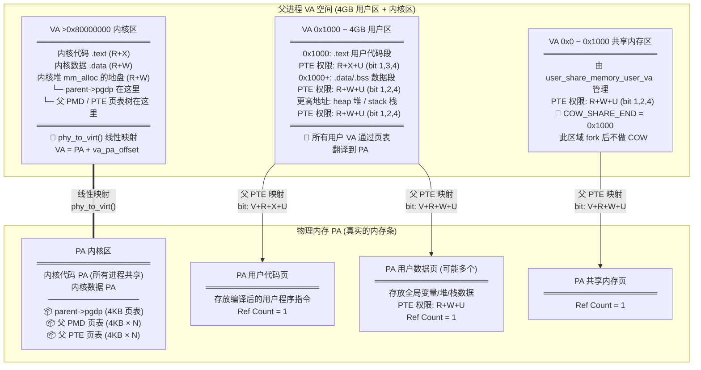

---

## 阶段 1：`user_create_force()` —— 分配子进程 PCB

> **代码**: `user/user.c` 第 390 行 → `__user_create()` 第 88-121 行
>
> **调用链**: `user_create_force()` → `__user_create()` → `mm_alloc(sizeof(struct user))` → `memset(清零)` → 初始化 `sstatus`, `memory_region`, `lock` → 加入 `per_cpu(user_list)`

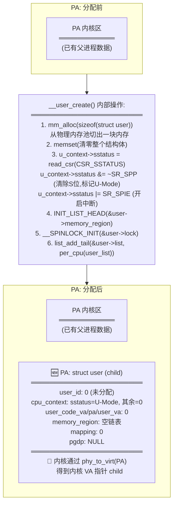

紧接着 `user_update_userid(child)` (`user/user.c` 第 394 行):
- 调用 `find_free_userid(&userid_bitmap)` 扫描全局位图
- 找到第一个为 0 的 bit 位（例如 bit[2]），将其置 1
- `child->user_id = 2`（此值即为 fork 最终返回给父进程的 PID）

---

## 阶段 2：`mm_alloc(PAGE_SIZE)` + `memcpy` —— 建立子进程 PGD

> **代码**: `user/user.c` 第 396-400 行

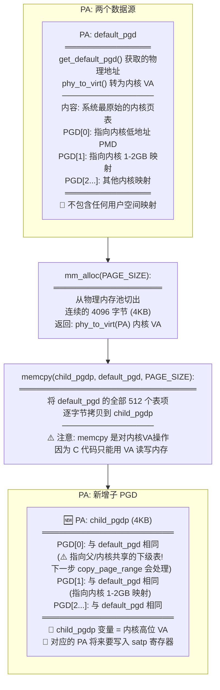

**为什么 PGD[0] 此时很危险？**
> `user/user.c` 第 402-407 行注释原文:
> "memcpy 继承了内核 PGD 的低地址映射(含内核代码 0x80200000 与用户区,
> 二者同在 PGD[0])。copy_page_range 会在遍历用户区时把与父共享的下级
> 页表逐级克隆成子私有表(保留内核等兄弟项)，从而只隔离用户区、不破坏内核映射。"

---

## 阶段 3：`copy_page_range()` —— COW 的核心魔法

> **代码**: `user/user.c` 第 408-418 行 → `mm/cow.c` 第 102-112 行
>
> 此阶段分为两个子步骤：3a 克隆中间级页表，3b 处理叶子 PTE。

### 3a. `copy_level()` 递归克隆页表树

> **代码**: `mm/cow.c` 第 34-96 行

遍历 `parent->memory_region` 链表中的每一个区域 `[region->start, region->end)`，
对每个区域调用 `copy_page_range(start, end, child_pgdp, parent_pgdp)`。

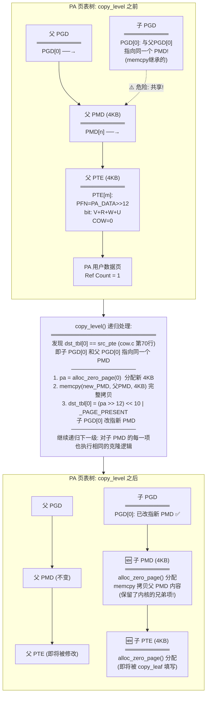

### 3b. `copy_leaf()` 处理叶子 PTE —— COW 标记的核心

> **代码**: `mm/cow.c` 第 15-31 行

当递归到最底层 (`shift == PAGE_SHIFT`, 即 `shift == 12`)，进入 `copy_leaf()`:

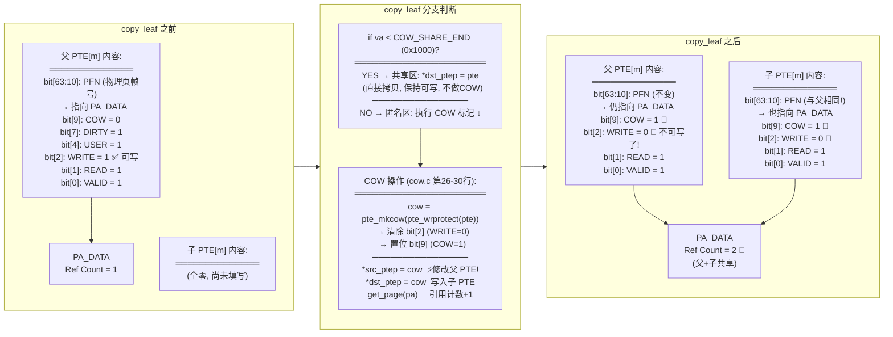

### 3c. 收尾: `add_user_space_memory()` + `local_flush_tlb_range()`

> **代码**: `user/user.c` 第 416-417 行, `mm/cow.c` 第 110 行

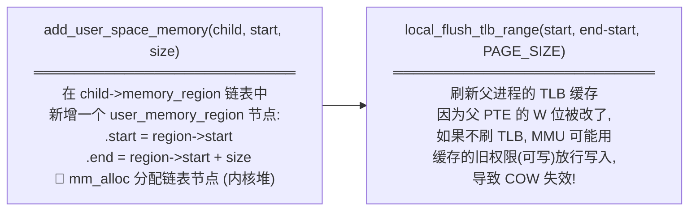

---

## 阶段 4：伪造 CPU 上下文

> **代码**: `user/user.c` 第 420-431 行

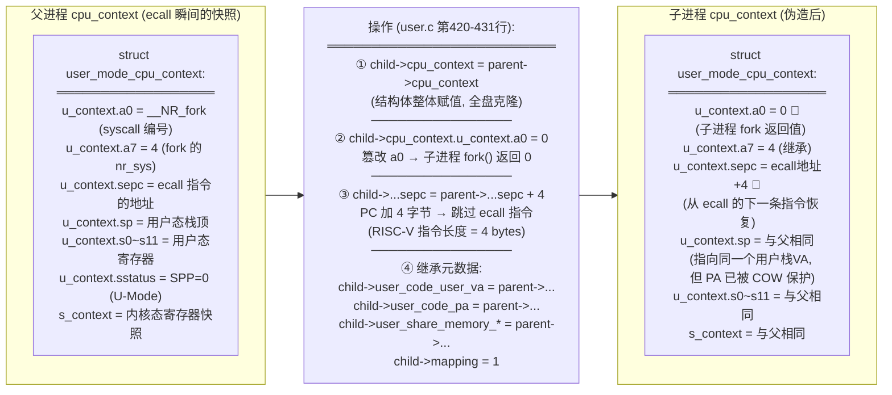

---

## 阶段 5：`create_task()` —— 注册到调度器

> **代码**: `user/user.c` 第 433-438 行

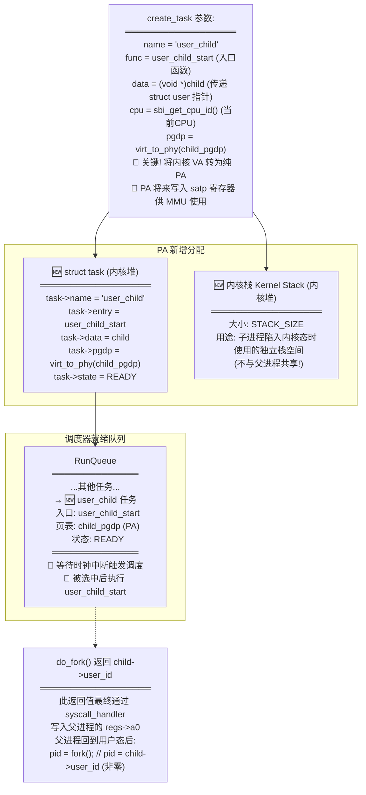

---

## 阶段 6：`do_fork` 完成后 —— 父子内存全景

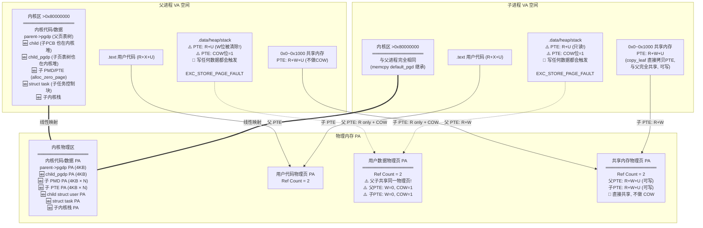

---

## 阶段 7：COW 触发 —— 子进程写入数据时的内存分裂

> 子进程被调度器选中 → 进入 `user_child_start()` (user.c 第355行)
> → `user_mode_switch_to()` 切入用户态 → 用户程序执行 `a[0] = 1;`

### 7a. 异常触发与路由

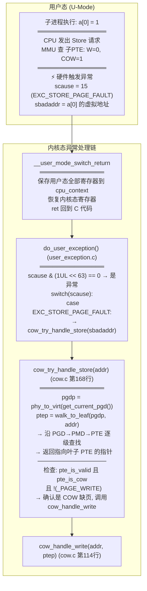

### 7b. `cow_handle_write()` 内部操作

> **代码**: `mm/cow.c` 第 114-141 行

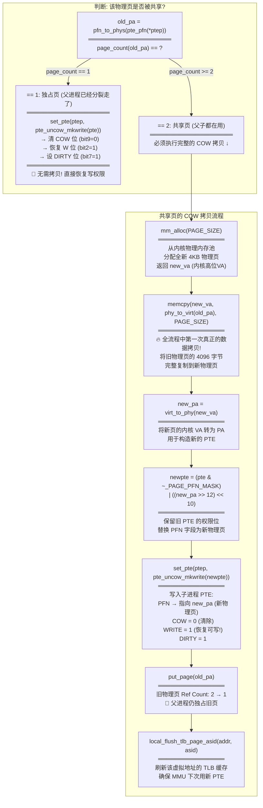

### 7c. COW 完成后的内存状态

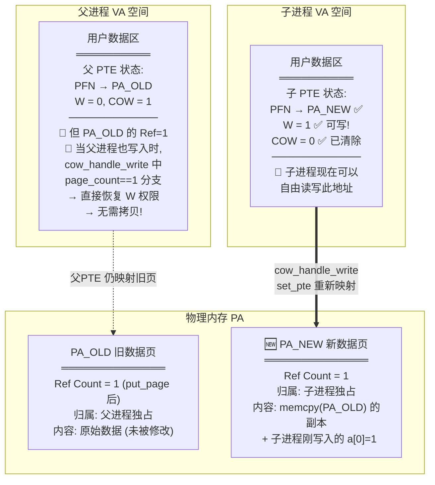

**至此，父子进程在该虚拟地址上的物理内存已经彻底分离，互不干扰。**

---

## 附录：`do_fork` 全过程内存变化一览表

| 步骤 | 调用函数 (代码位置) | VA 空间变化 | PA 空间变化 | 页表变化 |
|:---:|:---|:---|:---|:---|
| 1 | `user_create_force()` (user.c:390) | 内核 VA 新增 child 指针 | 新增 struct user (内核堆PA) | 无 |
| 2 | `user_update_userid()` (user.c:394) | 无 | 修改 userid_bitmap 的 1bit | 无 |
| 3 | `mm_alloc(PAGE_SIZE)` (user.c:396) | 内核 VA 新增 child_pgdp | 新增 4KB 顶级页表 (内核堆PA) | 子 PGD 诞生(空白) |
| 4 | `memcpy(child_pgdp, default_pgd)` (user.c:400) | 无 | 子 PGD 被写入 512 个表项 | 子 PGD 高位项 = 内核映射 |
| 5 | `copy_level()` (cow.c:34) | 无 | 新增 N 个 4KB 中间级页表 | 子拥有独立 PMD/PTE 页表树 |
| 6 | `copy_leaf()` (cow.c:15) | 无 | 用户数据页 Ref: 1→2 | **父子PTE均: W→0, COW→1** |
| 7 | `local_flush_tlb_range()` (cow.c:110) | 无 | 无 | TLB 失效, 强制重新查表 |
| 8 | `cpu_context = parent->...` (user.c:420) | 无 | child 结构体内 ctx 字段被覆写 | 无 |
| 9 | `a0=0, sepc+=4` (user.c:421-423) | 无 | child 结构体内 a0/sepc 被篡改 | 无 |
| 10 | `继承元数据` (user.c:425-431) | 无 | child 的 code_va/pa/share 等字段被赋值 | 无 |
| 11 | `create_task()` (user.c:433) | 无 | 新增 task 结构体 + 内核栈 | `virt_to_phy(child_pgdp)` 记入 task |
| 后续 | `cow_handle_write()` (cow.c:114) | 无 | 新增 4KB 数据页, 旧页 Ref: 2→1 | 写入方 PTE: PFN改, W=1, COW=0 |
