# GOS `do_fork()` 与 COW 内存变化全过程图解

> 本文档严格参考 GOS 项目源码 `user/user.c`（第 383-439 行）、`mm/cow.c`、
> `include/gos/user.h`、`include/asm/pgtable.h`，
> 用内存框图逐步还原 `do_fork()` 执行期间 VA（虚拟地址）、PA（物理地址）、
> 页表（PGD/PMD/PTE）的每一次变化。每个箭头上标注的是**实际触发该变化的项目函数**。

---

## 背景知识速查

### GOS 用户空间地址范围 (`include/gos/user.h` 第 27-34 行)
| 宏定义 | 值 | 含义 |
|:---|:---|:---|
| `USER_SPACE_CODE_START` | `0x1000` | 用户代码起始地址 |
| `USER_SPACE_FIXED_MMAP` | `0x0` | 固定映射区起始 |
| `USER_SPACE_FIXED_MMAP_SIZE` | `1GB` | 固定映射区大小 |
| `USER_SPACE_TOTAL_SIZE` | `4GB` | 用户空间总大小 |

### RISC-V PTE 权限位定义 (`include/asm/pgtable.h` 第 122-131 行)
| 位 | 宏名 | bit | 含义 |
|:---:|:---|:---:|:---|
| 0 | `_PAGE_PRESENT` | bit[0] | 页表项有效 |
| 1 | `_PAGE_READ` | bit[1] | 可读 |
| 2 | `_PAGE_WRITE` | bit[2] | 可写 |
| 3 | `_PAGE_EXEC` | bit[3] | 可执行 |
| 4 | `_PAGE_USER` | bit[4] | 用户态可访问 |
| 5 | `_PAGE_GLOBAL` | bit[5] | 全局页（不随 ASID 刷新） |
| 6 | `_PAGE_ACCESSED` | bit[6] | 已被访问（硬件自动置位） |
| 7 | `_PAGE_DIRTY` | bit[7] | 已被写入（硬件自动置位） |
| 8 | `_PAGE_SOFT` | bit[8] | 软件保留位 |
| 9 | `_PAGE_COW` | bit[9] | **写时复制标记（GOS 自定义）** |

### PTE 操作函数 (`include/asm/pgtable.h` 第 182-199 行)
| 函数 | 代码 | 作用 |
|:---|:---|:---|
| `pte_wrprotect(pte)` | `return pte & ~_PAGE_WRITE` | 清除 bit[2]，剥夺写权限 |
| `pte_mkcow(pte)` | `return pte \| _PAGE_COW` | 置位 bit[9]，标记 COW |
| `pte_is_cow(pte)` | `return !!(pte & _PAGE_COW)` | 检查是否为 COW 页 |
| `pte_uncow_mkwrite(pte)` | `return (pte & ~_PAGE_COW) \| _PAGE_WRITE \| _PAGE_DIRTY` | 清 COW，恢复写权限 |

### `struct user` 关键字段 (`include/gos/user.h` 第 179-195 行)
```
struct user {
    struct list_head list;               // 挂在 per_cpu(user_list) 上
    int user_id;                         // 进程 PID
    struct user_mode_cpu_context cpu_context; // 包含 s_context(内核态) + u_context(用户态)
    unsigned long user_code_va;          // 用户代码段的内核虚拟地址
    unsigned long user_code_pa;          // 用户代码段的物理地址
    unsigned long user_code_user_va;     // 用户代码段的用户虚拟地址 (0x1000)
    unsigned long user_share_memory_va;  // 共享内存的内核虚拟地址
    unsigned long user_share_memory_pa;  // 共享内存的物理地址
    unsigned long user_share_memory_user_va; // 共享内存的用户虚拟地址
    spinlock_t lock;
    struct list_head memory_region;      // 用户空间内存区域链表
    int mapping;                         // 是否已完成映射
    void *pgdp;                          // 本进程的顶级页表基址 (PA)
};
```

### 页表树结构（以 Sv39 为例, `PGDIR_SHIFT = 30`）
```
                    PGD (顶级页表, 4KB, 512项)
                    ├── PGD[0] ─→ PMD (中间级页表, 4KB, 512项)
                    │              ├── PMD[n] ─→ PTE (最底层页表, 4KB, 512项)
                    │              │              ├── PTE[m] ─→ 物理页 PA (4KB数据)
                    │              │              └── ...
                    │              └── ...
                    ├── PGD[1] ─→ (1GB 内核映射)
                    └── ...
    每一级: 512项 × 8字节 = 4KB = 1个物理页
    VA 的拆分: [PGD索引 9bit][PMD索引 9bit][PTE索引 9bit][页内偏移 12bit]
```

---

## 阶段 0：fork 之前 —— 只有父进程

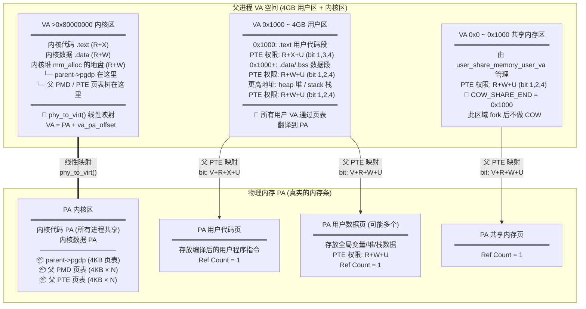

---

## 阶段 1：`user_create_force()` —— 分配子进程 PCB

> **代码**: `user/user.c` 第 390 行 → `__user_create()` 第 88-121 行
>
> **调用链**: `user_create_force()` → `__user_create()` → `mm_alloc(sizeof(struct user))` → `memset(清零)` → 初始化 `sstatus`, `memory_region`, `lock` → 加入 `per_cpu(user_list)`

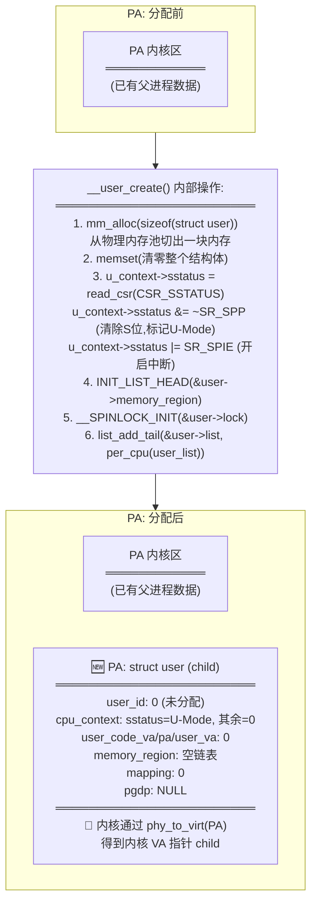

紧接着 `user_update_userid(child)` (`user/user.c` 第 394 行):
- 调用 `find_free_userid(&userid_bitmap)` 扫描全局位图
- 找到第一个为 0 的 bit 位（例如 bit[2]），将其置 1
- `child->user_id = 2`（此值即为 fork 最终返回给父进程的 PID）

---

## 阶段 2：`mm_alloc(PAGE_SIZE)` + `memcpy` —— 建立子进程 PGD

> **代码**: `user/user.c` 第 396-400 行

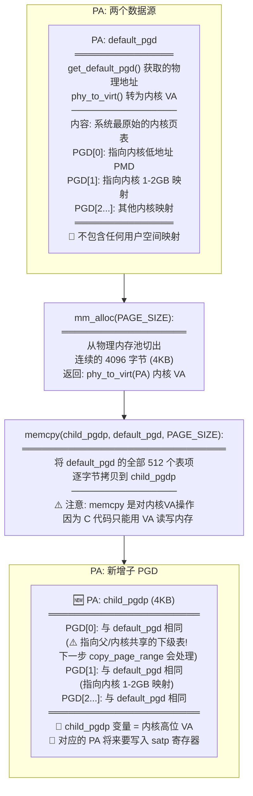

**为什么 PGD[0] 此时很危险？**
> `user/user.c` 第 402-407 行注释原文:
> "memcpy 继承了内核 PGD 的低地址映射(含内核代码 0x80200000 与用户区,
> 二者同在 PGD[0])。copy_page_range 会在遍历用户区时把与父共享的下级
> 页表逐级克隆成子私有表(保留内核等兄弟项)，从而只隔离用户区、不破坏内核映射。"

---

## 阶段 3：`copy_page_range()` —— COW 的核心魔法

> **代码**: `user/user.c` 第 408-418 行 → `mm/cow.c` 第 102-112 行
>
> 此阶段分为两个子步骤：3a 克隆中间级页表，3b 处理叶子 PTE。

### 3a. `copy_level()` 递归克隆页表树

> **代码**: `mm/cow.c` 第 34-96 行

遍历 `parent->memory_region` 链表中的每一个区域 `[region->start, region->end)`，
对每个区域调用 `copy_page_range(start, end, child_pgdp, parent_pgdp)`。

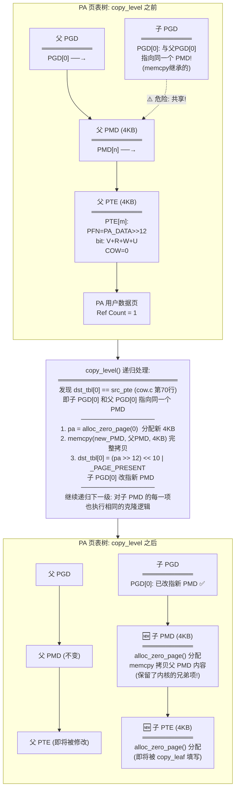

### 3b. `copy_leaf()` 处理叶子 PTE —— COW 标记的核心

> **代码**: `mm/cow.c` 第 15-31 行

当递归到最底层 (`shift == PAGE_SHIFT`, 即 `shift == 12`)，进入 `copy_leaf()`:

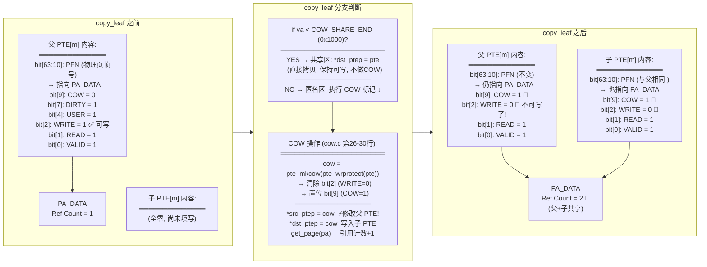

### 3c. 收尾: `add_user_space_memory()` + `local_flush_tlb_range()`

> **代码**: `user/user.c` 第 416-417 行, `mm/cow.c` 第 110 行

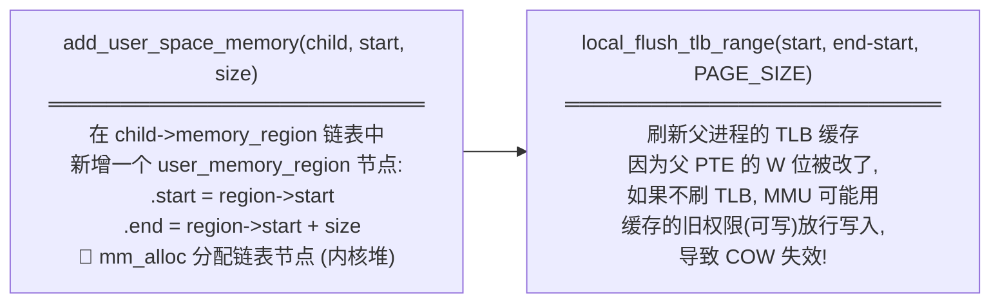

---

## 阶段 4：伪造 CPU 上下文

> **代码**: `user/user.c` 第 420-431 行

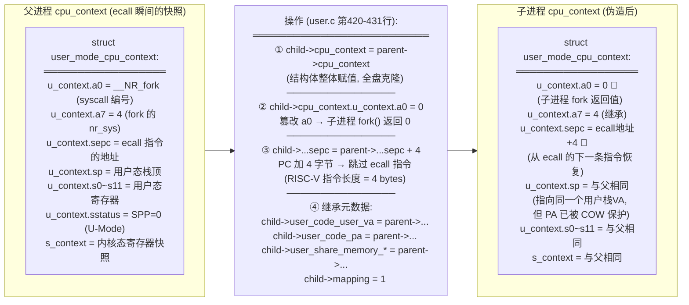

---

## 阶段 5：`create_task()` —— 注册到调度器

> **代码**: `user/user.c` 第 433-438 行

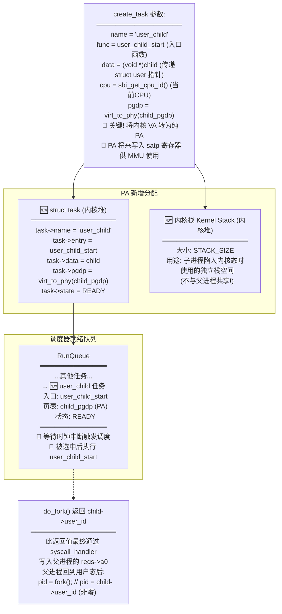

---

## 阶段 6：`do_fork` 完成后 —— 父子内存全景

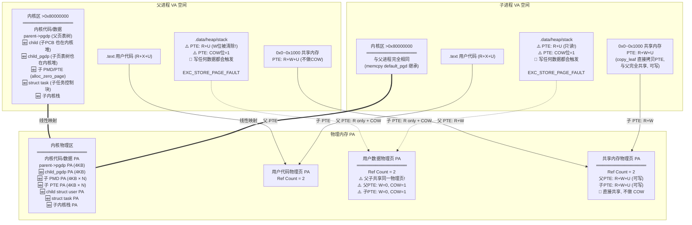

---

## 阶段 7：COW 触发 —— 子进程写入数据时的内存分裂

> 子进程被调度器选中 → 进入 `user_child_start()` (user.c 第355行)
> → `user_mode_switch_to()` 切入用户态 → 用户程序执行 `a[0] = 1;`

### 7a. 异常触发与路由

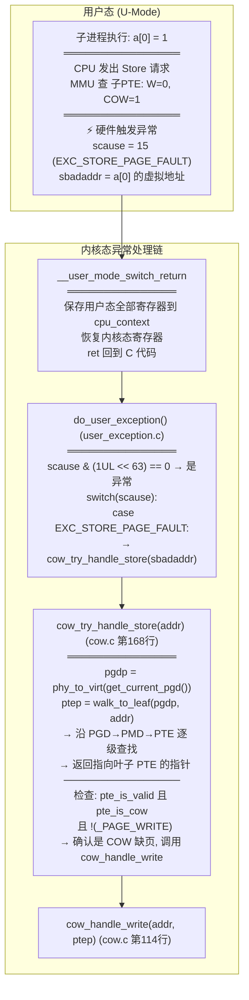

### 7b. `cow_handle_write()` 内部操作

> **代码**: `mm/cow.c` 第 114-141 行

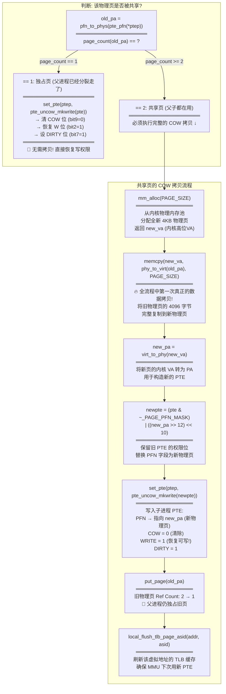

### 7c. COW 完成后的内存状态

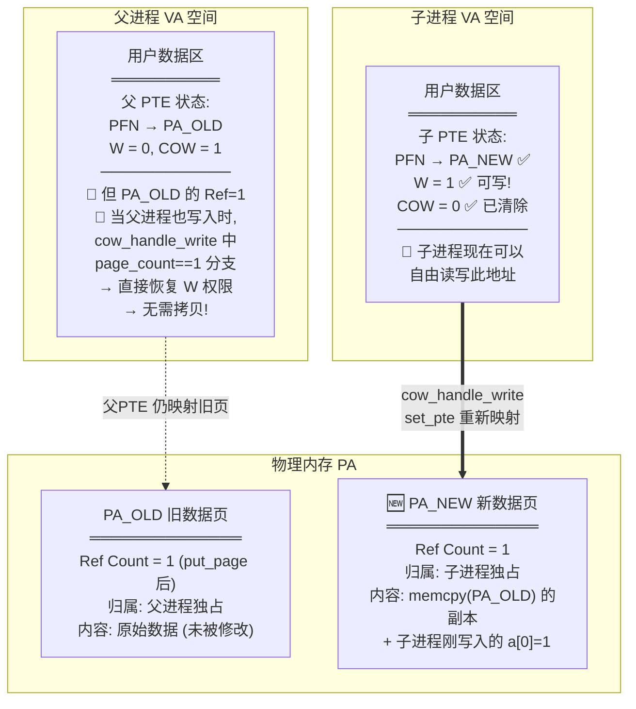

**至此，父子进程在该虚拟地址上的物理内存已经彻底分离，互不干扰。**

---

## 附录：`do_fork` 全过程内存变化一览表

| 步骤 | 调用函数 (代码位置) | VA 空间变化 | PA 空间变化 | 页表变化 |
|:---:|:---|:---|:---|:---|
| 1 | `user_create_force()` (user.c:390) | 内核 VA 新增 child 指针 | 新增 struct user (内核堆PA) | 无 |
| 2 | `user_update_userid()` (user.c:394) | 无 | 修改 userid_bitmap 的 1bit | 无 |
| 3 | `mm_alloc(PAGE_SIZE)` (user.c:396) | 内核 VA 新增 child_pgdp | 新增 4KB 顶级页表 (内核堆PA) | 子 PGD 诞生(空白) |
| 4 | `memcpy(child_pgdp, default_pgd)` (user.c:400) | 无 | 子 PGD 被写入 512 个表项 | 子 PGD 高位项 = 内核映射 |
| 5 | `copy_level()` (cow.c:34) | 无 | 新增 N 个 4KB 中间级页表 | 子拥有独立 PMD/PTE 页表树 |
| 6 | `copy_leaf()` (cow.c:15) | 无 | 用户数据页 Ref: 1→2 | **父子PTE均: W→0, COW→1** |
| 7 | `local_flush_tlb_range()` (cow.c:110) | 无 | 无 | TLB 失效, 强制重新查表 |
| 8 | `cpu_context = parent->...` (user.c:420) | 无 | child 结构体内 ctx 字段被覆写 | 无 |
| 9 | `a0=0, sepc+=4` (user.c:421-423) | 无 | child 结构体内 a0/sepc 被篡改 | 无 |
| 10 | `继承元数据` (user.c:425-431) | 无 | child 的 code_va/pa/share 等字段被赋值 | 无 |
| 11 | `create_task()` (user.c:433) | 无 | 新增 task 结构体 + 内核栈 | `virt_to_phy(child_pgdp)` 记入 task |
| 后续 | `cow_handle_write()` (cow.c:114) | 无 | 新增 4KB 数据页, 旧页 Ref: 2→1 | 写入方 PTE: PFN改, W=1, COW=0 |

---

## 全景流程图：Fork + COW 完整调用链

> 从用户态 `fork()` 发起 → ecall 陷入 → 内核完成 fork → 子进程被调度 → 用户态写触发 COW → 延迟拷贝完成
> 的**每一个函数、每一条关键指令、每一个 PTE bit 变化**。

```mermaid
flowchart TB
    %% ═══════════════════════════════════════════════
    %% 第一部分：用户态发起 fork
    %% ═══════════════════════════════════════════════

    subgraph UMODE_FORK ["🟦 U-Mode 用户态 — 父进程发起 fork"]
        direction TB
        U1["📄 myUser/lib/fork.c:3-4<br/>int fork（void）{<br/>  return （int）syscall（__NR_fork）;<br/>}<br/>═══════════════<br/>__NR_fork = 4<br/>（include/uapi/syscall.h:28）"]
        U2["📄 myUser/core/syscall.S:20-31<br/>syscall:<br/>  mv t0, a0    // t0 = __NR_fork = 4<br/>  mv a0, a1    // 移动参数<br/>  mv a7, t0    // a7 = 4（系统调用号）<br/>  <b>ecall</b>        // ⚡ 触发 EXC_SYSCALL（scause=8）<br/>  ret           // ecall 返回后继续执行"]
        U1 --> U2
    end

    %% ═══════════════════════════════════════════════
    %% 第二部分：硬件陷入 + 汇编保存上下文
    %% ═══════════════════════════════════════════════

    subgraph HW_TRAP ["⚙️ 硬件 + 汇编 — ecall 陷入内核"]
        direction TB
        HW1["🔧 RISC-V 硬件自动操作:<br/>═══════════════════<br/>① scause ← 8（EXC_SYSCALL）<br/>② sepc ← ecall 指令的 PC 地址<br/>③ sstatus.SPP ← 0（来自 U-Mode）<br/>④ PC ← stvec（= __user_mode_switch_return）"]
        HW2["📄 user/user_mode_switch.S:23-135<br/>__user_mode_switch_return:<br/>═══════════════════════<br/>① csrrw a0, sscratch, a0<br/>  （a0 ↔ sscratch，取出 cpu_context 指针）<br/>② sd ra/sp/gp/.../s11 → USER_CPU_U_*（a0）<br/>  （保存全部 31 个通用寄存器到 u_context）<br/>③ fsd f0~f31 → USER_U_F*（a0）<br/>  （保存 32 个浮点寄存器）<br/>④ csrr t0, sepc → sd → USER_CPU_U_SEPC<br/>  （保存异常返回地址）<br/>⑤ 恢复 S 态寄存器: stvec/sscratch/sstatus<br/>⑥ ld ra/sp/.../s11 ← USER_CPU_S_*<br/>  （恢复内核态 callee-saved 寄存器）<br/>⑦ <b>ret</b>（返回到 C 函数 user_mode_switch_to 的调用处）"]
        HW1 --> HW2
    end

    %% ═══════════════════════════════════════════════
    %% 第三部分：C 异常分发
    %% ═══════════════════════════════════════════════

    subgraph EXCEPTION_DISPATCH ["🟧 S-Mode 异常分发"]
        direction TB
        EX1["📄 user/user.c:369-377 — user_child_start 主循环<br/>═══════════════════════════<br/>while（1）{<br/>  disable_local_irq（）;<br/>  user_mode_switch_to（&child→cpu_context）;  // sret 进 U 态<br/>  ← __user_mode_switch_return 回到这里<br/>  if（<b>do_user_exception（child, regs）</b> == -1）<br/>    break;<br/>  enable_local_irq（）;<br/>}"]
        EX2["📄 user/user_exception.c:90-136<br/>do_user_exception（user, regs）:<br/>═══════════════════════════<br/>① memcpy（regs ← u_context）<br/>② regs→scause = read_csr（CSR_SCAUSE）<br/>③ regs→sbadaddr = read_csr（CSR_STVAL）<br/>④ if !（scause & （1UL<<63））→ 是异常<br/>  switch（scause）:"]
        EX3{"scause == ?"}
        EX4["case 8（EXC_SYSCALL）:<br/>  syscall_handler（u_context）<br/>  u_context→sepc += 4"]
        EX5["case 15（EXC_STORE_PAGE_FAULT）:<br/>  cow_try_handle_store（sbadaddr）<br/>  ← COW 路径，阶段7详述"]
        EX1 --> EX2 --> EX3
        EX3 -->|"scause=8"| EX4
        EX3 -->|"scause=15"| EX5
    end

    %% ═══════════════════════════════════════════════
    %% 第四部分：syscall 分发到 sys_fork
    %% ═══════════════════════════════════════════════

    subgraph SYSCALL_DISPATCH ["🟧 系统调用分发"]
        direction TB
        SC1["📄 user/user_exception.c:36-47<br/>syscall_handler（regs）:<br/>═══════════════════<br/>nr_sys = regs→a7     // = 4<br/>fn = syscall_table[4] // = sys_fork<br/>regs→a0 = fn（orig_a0, a1...a6）<br/>  // 返回值写入 a0 → 父进程 fork 返回值"]
        SC2["📄 user/syscall.c:64-72<br/>sys_fork（void）:<br/>═══════════════<br/>parent = get_current_user（）<br/>return <b>do_fork（parent）</b>"]
        SC1 --> SC2
    end

    %% ═══════════════════════════════════════════════
    %% 第五部分：do_fork 主体
    %% ═══════════════════════════════════════════════

    subgraph DO_FORK ["🟥 do_fork（） — 核心 fork 逻辑"]
        direction TB

        F1["📄 user/user.c:390 → __user_create（）:88-121<br/><b>步骤1: 分配子进程 PCB</b><br/>═══════════════════════════<br/>① mm_alloc（sizeof（struct user））→ 内核堆分配<br/>② memset（清零整个结构体）<br/>③ sstatus 配置:<br/>  sstatus &= ~SR_SPP  // 清 S 位 → U-Mode<br/>  sstatus |= SR_SPIE   // 开启中断<br/>④ INIT_LIST_HEAD（&user→memory_region）<br/>⑤ __SPINLOCK_INIT（&user→lock）<br/>⑥ list_add_tail → per_cpu（user_list）"]

        F2["📄 user/user.c:394<br/><b>步骤2: 分配 user_id</b><br/>═══════════════════<br/>user_update_userid（child）<br/>→ find_free_userid（&userid_bitmap）<br/>  扫描 64-bit 位图找到第一个 0 位<br/>  置位并赋值 child→user_id"]

        F3["📄 user/user.c:396-400<br/><b>步骤3: 创建子 PGD</b><br/>═══════════════════════════<br/>① child_pgdp = mm_alloc（PAGE_SIZE）<br/>  分配 4KB 页表页（512 × 8B 表项）<br/>② default_pgd = phy_to_virt（get_default_pgd（））<br/>③ memcpy（child_pgdp, default_pgd, PAGE_SIZE）<br/>  ⚠️ 子 PGD 继承内核映射<br/>  ⚠️ PGD[0] 与内核/父共享同一 PMD!"]

        F4["📄 user/user.c:408-418<br/><b>步骤4: 遍历父 memory_region</b><br/>═══════════════════════════<br/>list_for_each_entry（region, &parent→memory_region）{<br/>  copy_page_range（region→start, region→end,<br/>    child_pgdp, phy_to_virt（parent→pgdp））<br/>  add_user_space_memory（child, start, size）<br/>}"]

        F1 --> F2 --> F3 --> F4
    end

    %% ═══════════════════════════════════════════════
    %% 第六部分：copy_page_range 递归页表克隆
    %% ═══════════════════════════════════════════════

    subgraph COPY_PAGE_RANGE ["🟪 copy_page_range（） — 递归页表克隆"]
        direction TB

        CPR1["📄 mm/cow.c:102-112<br/>copy_page_range（start, end, dst_pgdp, src_pgdp）:<br/>═══════════════════════════════<br/>ret = copy_level（dst_pgdp, src_pgdp, 0,<br/>  <b>PGDIR_SHIFT</b>, start, end）<br/>═══════════════════════════════<br/>Sv39: PGDIR_SHIFT = 30<br/>递归深度: 30 → 21 → 12（三级）<br/>VA 拆分: [PGD 9bit][PMD 9bit][PTE 9bit][offset 12bit]"]

        CPR2["📄 mm/cow.c:34-96<br/>copy_level（dst_tbl, src_tbl, va_base, shift, start, end）:<br/>═══════════════════════════════════<br/>for i = 0..511:<br/>  va = va_base | （i << shift）<br/>  src_pte = src_tbl[i]<br/>  ───────────────────<br/>  if src_pte == 0 → skip<br/>  if va 不在 [start,end) → skip"]

        CPR3{"shift == PAGE_SHIFT（12）?"}

        CPR4["<b>叶子层（shift=12）→ copy_leaf</b><br/>见下方详细展开"]

        CPR5{"dst_tbl[i] 状态?"}

        CPR6["dst_tbl[i] == 0（子无此级表）<br/>═══════════════════<br/>📄 cow.c:61-69<br/>pa = alloc_zero_page（0）<br/>dst_tbl[i] = （pa>>12）<<10 | _PAGE_PRESENT<br/>新建一张空的 4KB 下级页表"]

        CPR7["dst_tbl[i] == src_pte（与父共享!）<br/>═══════════════════════<br/>📄 cow.c:70-85<br/>⚠️ memcpy 继承导致子与父<br/>指向同一张下级表<br/>───────────────<br/>pa = alloc_zero_page（0）<br/>memcpy（new, src_child, PAGE_SIZE）<br/>dst_tbl[i] = 指向新分配的表<br/>📌 保留了内核的兄弟项!"]

        CPR8["dst_tbl[i] 已私有（前一 region 克隆）<br/>═══════════════════<br/>📄 cow.c:86 注释<br/>直接复用，不重新分配"]

        CPR9["<b>递归下一级</b><br/>═══════════════<br/>copy_level（dst_child, src_child,<br/>  va, <b>shift - 9</b>, start, end）<br/>───────────────<br/>shift=30→21: PGD→PMD<br/>shift=21→12: PMD→PTE"]

        CPR2 --> CPR3
        CPR3 -->|"是 ← 到达最底层"| CPR4
        CPR3 -->|"否 ← 中间级"| CPR5
        CPR5 -->|"== 0"| CPR6
        CPR5 -->|"== src_pte"| CPR7
        CPR5 -->|"已私有"| CPR8
        CPR6 --> CPR9
        CPR7 --> CPR9
        CPR8 --> CPR9
    end

    %% ═══════════════════════════════════════════════
    %% 第七部分：copy_leaf — COW 标记核心
    %% ═══════════════════════════════════════════════

    subgraph COPY_LEAF ["🟩 copy_leaf（） — COW 标记核心"]
        direction TB

        CL1["📄 mm/cow.c:15-31<br/>copy_leaf（dst_ptep, src_ptep, va）:<br/>═══════════════════════════<br/>pte = *src_ptep  // 读取父 PTE<br/>pa = pfn_to_phys（pte_pfn（pte））"]

        CL2{"va < COW_SHARE_END<br/>（0x1000）?"}

        CL3["<b>共享内存区</b><br/>═══════════════<br/>*dst_ptep = pte<br/>直接拷贝 PTE，保持可写<br/>父子共享同一物理页<br/>不做 COW"]

        CL4["<b>匿名页区 → 执行 COW 标记</b><br/>═══════════════════════════<br/>📄 cow.c:26-28<br/><br/>cow = pte_mkcow（pte_wrprotect（pte））<br/>═══════════════════════════<br/>pte_wrprotect: pte & ~_PAGE_WRITE<br/>  → bit[2] = 0 ❌ 清除写权限<br/>pte_mkcow: pte | _PAGE_COW<br/>  → bit[9] = 1 🔴 设置 COW 标记<br/>═══════════════════════════<br/>*src_ptep = cow  ⚡ 修改父 PTE!<br/>*dst_ptep = cow  写入子 PTE<br/>═══════════════════════════<br/>PTE bit 变化:<br/>  WRITE: 1→0  COW: 0→1<br/>  READ: 不变  VALID: 不变<br/>  USER: 不变  PFN: 不变"]

        CL5["get_page（pa）<br/>═══════════════<br/>📄 mm/mm.c:527-543<br/>spin_lock_irqsave（&mem_lock）<br/>if refcount == 0 → refcount = 2<br/>else → refcount++<br/>spin_unlock_irqrestore<br/>───────────────<br/>结果: Ref Count 1→2<br/>父子共享同一物理页"]

        CL1 --> CL2
        CL2 -->|"是（< 0x1000）"| CL3
        CL2 -->|"否（≥ 0x1000）"| CL4
        CL4 --> CL5
    end

    %% ═══════════════════════════════════════════════
    %% 第八部分：TLB 刷新 + 上下文克隆
    %% ═══════════════════════════════════════════════

    subgraph FORK_FINISH ["🟧 Fork 收尾"]
        direction TB

        FF1["📄 mm/cow.c:110<br/><b>TLB 刷新</b><br/>═══════════════<br/>local_flush_tlb_range（start, end-start, PAGE_SIZE）<br/>⚠️ 父 PTE 的 W 位已被改为 0<br/>必须刷新 TLB 使 MMU 重新查表<br/>否则 CPU 可能用缓存的旧权限放行写入"]

        FF2["📄 user/user.c:416-417<br/><b>记录子内存区域</b><br/>═══════════════════<br/>add_user_space_memory（child, start, size）<br/>在 child→memory_region 链表中新增节点:<br/>  .start = region→start<br/>  .end = region→start + size"]

        FF3["📄 user/user.c:420-431<br/><b>克隆 CPU 上下文 + 伪造返回值</b><br/>═══════════════════════════════<br/>① child→cpu_context = parent→cpu_context<br/>  （结构体整体赋值，全盘克隆所有寄存器）<br/>───────────────────────<br/>② child→cpu_context.u_context.<b>a0 = 0</b><br/>  📌 子进程的 fork（） 将返回 0<br/>───────────────────────<br/>③ child→sepc = parent→sepc + <b>4</b><br/>  📌 RISC-V 指令 4 字节<br/>  📌 跳过 ecall，从下一条指令恢复<br/>───────────────────────<br/>④ 继承元数据:<br/>  user_code_user_va / user_code_pa<br/>  user_share_memory_* 等<br/>  child→mapping = 1"]

        FF4["📄 user/user.c:433-438<br/><b>注册到调度器</b><br/>═══════════════════════════<br/>create_task（<br/>  name = 'user_child',<br/>  func = user_child_start,<br/>  data = child,<br/>  cpu = sbi_get_cpu_id（）,<br/>  pgdp = <b>virt_to_phy（child_pgdp）</b><br/>）<br/>📌 PA 将来写入 satp 寄存器<br/>📌 task 加入 RunQueue 等待调度"]

        FF5["<b>return child→user_id</b><br/>═══════════════════<br/>返回值回到 syscall_handler:<br/>regs→a0 = child→user_id（非零）<br/>然后 u_context→sepc += 4<br/>───────────────────<br/>sret 返回用户态后:<br/>父进程得到 pid = child→user_id"]

        FF1 --> FF2 --> FF3 --> FF4 --> FF5
    end

    %% ═══════════════════════════════════════════════
    %% 第九部分：子进程被调度执行
    %% ═══════════════════════════════════════════════

    subgraph CHILD_SCHEDULE ["🟦 子进程被调度 → 进入用户态"]
        direction TB

        CS1["⏰ 定时器中断触发 schedule（）<br/>═══════════════════════════<br/>调度器从 RunQueue 选中 user_child 任务<br/>切换 satp 寄存器:<br/>  satp = SATP_MODE_39 | （child_pgdp_PA >> 12）<br/>  sfence.vma  // 刷新 TLB"]

        CS2["📄 user/user.c:355-379<br/>user_child_start（data = child）:<br/>═══════════════════════════<br/>① regs = mm_alloc（sizeof（struct pt_regs））<br/>② child→pgdp = get_current_task（）→pgdp<br/>③ set_current_user（child）<br/>④ 进入主循环: while（1）{<br/>  disable_local_irq（）;<br/>  <b>user_mode_switch_to（&child→cpu_context）</b><br/>  ..."]

        CS3["📄 user/user_mode_switch.S:219-416<br/>user_mode_switch_to:<br/>═══════════════════════════<br/>① 保存 S 态 callee-saved → USER_CPU_S_*<br/>② 加载 u_context.sstatus → csrw CSR_SSTATUS<br/>③ __user_mode_switch_return → csrw CSR_STVEC<br/>④ u_context.sepc → csrw CSR_SEPC<br/>  📌 = 父的 ecall 地址 + 4<br/>⑤ cpu_context 指针 → csrw CSR_SSCRATCH<br/>⑥ 加载全部 u_context 通用/浮点寄存器<br/>⑦ ld a0, USER_CPU_U_A0 → <b>a0 = 0</b><br/>  📌 fork 返回值!<br/>⑧ <b>sret</b><br/>  → PC = sepc（ecall 的下一条）<br/>  → 特权级 U-Mode（SPP=0）<br/>  → 子进程开始在用户态运行"]

        CS1 --> CS2 --> CS3
    end

    %% ═══════════════════════════════════════════════
    %% 第十部分：子进程写触发 COW
    %% ═══════════════════════════════════════════════

    subgraph COW_TRIGGER ["⚡ 子进程写数据 → Store Page Fault"]
        direction TB

        CT1["🟦 U-Mode 子进程执行:<br/>═══════════════<br/>a[0] = 1;  // Store 指令<br/>───────────────<br/>MMU 查 子 PTE:<br/>  _PAGE_VALID = 1 ✅<br/>  _PAGE_READ = 1 ✅<br/>  _PAGE_WRITE = 0 ❌<br/>  _PAGE_COW = 1<br/>───────────────<br/>⚡ 硬件触发异常:<br/>  scause = 15（EXC_STORE_PAGE_FAULT）<br/>  stval = a[0] 的虚拟地址"]

        CT2["汇编 __user_mode_switch_return<br/>═══════════════════════<br/>保存用户态全部寄存器<br/>恢复内核态寄存器<br/>ret 回到 C"]

        CT3["📄 user/user_exception.c:112-119<br/>do_user_exception → switch:<br/>═══════════════════════<br/>case EXC_STORE_PAGE_FAULT:<br/>  ret = <b>cow_try_handle_store（stval）</b><br/>  ⚠️ 不 sepc += 4!<br/>  📌 COW 处理后原指令重执行"]

        CT1 --> CT2 --> CT3
    end

    %% ═══════════════════════════════════════════════
    %% 第十一部分：COW 处理核心
    %% ═══════════════════════════════════════════════

    subgraph COW_HANDLE ["🟩 cow_try_handle_store + cow_handle_write — COW 延迟拷贝"]
        direction TB

        CH1["📄 mm/cow.c:168-178<br/>cow_try_handle_store（addr）:<br/>═══════════════════════<br/>① pgdp = phy_to_virt（get_current_pgd（））<br/>② ptep = walk_to_leaf（pgdp, addr）<br/>───────────────────────<br/>walk_to_leaf（cow.c:145-162）:<br/>  tbl = pgdp, shift = PGDIR_SHIFT（30）<br/>  while（1）:<br/>    ptep = &tbl[（va >> shift）& 0x1FF]<br/>    if shift == 12 → return ptep  // 叶子<br/>    if *ptep == 0 → return NULL   // 未映射<br/>    tbl = phy_to_virt（pfn→phys）<br/>    shift -= 9<br/>  三级遍历: PGD→PMD→PTE<br/>───────────────────────<br/>③ 检查: valid && COW && !WRITE<br/>  → 确认是 COW 缺页<br/>  → cow_handle_write（addr, ptep）"]

        CH2["📄 mm/cow.c:114-141<br/>cow_handle_write（addr, ptep）:<br/>═══════════════════════<br/>pte = *ptep<br/>old_pa = pfn_to_phys（pte_pfn（pte））<br/>asid = task→id"]

        CH3{"page_count（old_pa）== ?<br/>（mm/mm.c:564-575）<br/>spin_lock → 读 refcount → spin_unlock"}

        CH4["<b>== 1 : 独占页（另一方已分裂）</b><br/>═══════════════════════════<br/>📄 cow.c:121-123<br/>set_pte（ptep, pte_uncow_mkwrite（pte））<br/>───────────────────────<br/>pte_uncow_mkwrite（pgtable.h:197-199）:<br/>  （pte & ~_PAGE_COW）| _PAGE_WRITE | _PAGE_DIRTY<br/>  → bit[9] COW: 1→0 ✅<br/>  → bit[2] WRITE: 0→1 ✅<br/>  → bit[7] DIRTY: →1<br/>═══════════════════════════<br/>📌 无需拷贝! 无需分配新页!<br/>📌 直接恢复写权限即可"]

        CH5["<b>≥ 2 : 共享页 → 完整 COW 拷贝</b><br/>═══════════════════════════════<br/>📄 cow.c:124-138<br/><br/>① new_va = mm_alloc（PAGE_SIZE）<br/>  从内核物理内存池分配全新 4KB<br/><br/>② memcpy（new_va, phy_to_virt（old_pa）, PAGE_SIZE）<br/>  🔥 全流程第一次真正的数据拷贝!<br/>  将旧物理页 4096 字节完整复制到新页<br/><br/>③ new_pa = virt_to_phy（new_va）<br/><br/>④ newpte =（pte & ~_PAGE_PFN_MASK）<br/>       |（（new_pa >> 12）<< 10）<br/>  保留旧权限位，替换 PFN 为新页<br/><br/>⑤ set_pte（ptep, pte_uncow_mkwrite（newpte））<br/>  子 PTE 变化:<br/>    PFN → 指向 PA_NEW（新物理页）<br/>    COW: 1→0  WRITE: 0→1  DIRTY: →1<br/><br/>⑥ put_page（old_pa）  // mm/mm.c:625-634<br/>  spin_lock → refcount-- → spin_unlock<br/>  Ref Count: 2→1<br/>  📌 旧页现在归父进程独占"]

        CH6["📄 cow.c:140<br/><b>TLB 刷新</b><br/>═══════════════<br/>local_flush_tlb_page_asid（addr, asid）<br/>刷新该虚拟地址的 TLB 缓存项<br/>确保 MMU 下次使用新的 PTE"]

        CH7["<b>return 0</b>（处理成功）<br/>═══════════════<br/>回到 do_user_exception<br/>⚠️ 不修改 sepc<br/>→ sret 后 CPU 重新执行<br/>  原来的 Store 指令<br/>→ 这次 PTE.W=1，写入成功!"]

        CH1 --> CH2 --> CH3
        CH3 -->|"== 1"| CH4
        CH3 -->|"≥ 2"| CH5
        CH4 --> CH6
        CH5 --> CH6
        CH6 --> CH7
    end

    %% ═══════════════════════════════════════════════
    %% 第十二部分：Spinlock 底层原子操作
    %% ═══════════════════════════════════════════════

    subgraph SPINLOCK ["🔒 Spinlock 底层实现（保护 refcount 并发安全）"]
        direction TB

        SL1["📄 lib/spinlocks.c — 三种可选实现<br/>（.config: CONFIG_SELECT_AMOSWAP_SPINLOCK=y）"]

        SL2["<b>AMO 版本</b>（当前启用）<br/>═══════════════════<br/>📄 spinlocks.c:29-38<br/>spin_trylock:<br/>  amoswap.w %0, %2, %1<br/>  RISCV_ACQUIRE_BARRIER<br/>───────────────<br/>spin_unlock:<br/>  __smp_store_release（&lock→lock, 0）"]

        SL3["<b>LR/SC 版本</b>（可选）<br/>═══════════════════<br/>📄 spinlocks.c:72-85<br/>  lr.w.aq %0, （%1）<br/>  bnez %0, lock<br/>  sc.w.rl %0, %2, （%1）<br/>  bnez %0, lock"]

        SL4["<b>AMOCAS 版本</b>（可选）<br/>═══════════════════<br/>📄 spinlocks.c:52-70<br/>  amocas.w.aqrl %0, %2, （%1）"]

        SL1 --> SL2
        SL1 --> SL3
        SL1 --> SL4
    end

    %% ═══════════════════════════════════════════════
    %% 连接关系
    %% ═══════════════════════════════════════════════

    UMODE_FORK --> HW_TRAP
    HW_TRAP --> EXCEPTION_DISPATCH
    EX4 --> SYSCALL_DISPATCH
    SYSCALL_DISPATCH --> DO_FORK
    F4 --> COPY_PAGE_RANGE
    CPR1 --> CPR2
    CPR4 --> COPY_LEAF
    COPY_PAGE_RANGE --> FORK_FINISH
    COPY_LEAF --> FORK_FINISH
    FORK_FINISH --> CHILD_SCHEDULE
    CHILD_SCHEDULE --> COW_TRIGGER
    EX5 -.->|"COW 路径"| COW_HANDLE
    COW_TRIGGER --> COW_HANDLE
    CH3 -.->|"spin_lock_irqsave"| SPINLOCK
```
